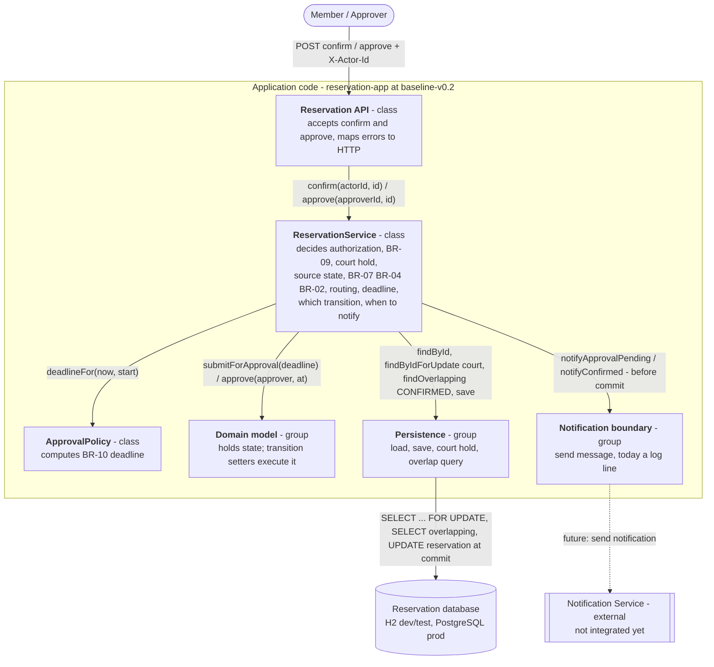

# Architecture and Decisions

## Overview
*Updated in C03 — full views (context, components, state ownership, runtime, sequence,
design classes) are in [`c03-architecture.md`](c03-architecture.md).*

A single Spring Boot application with six logical elements:

```
              Reservation API (ReservationController)   HTTP + actor header; decides nothing
                 |                              |
                 v                              v
   Reservation Lifecycle  ------------->  Approval Workflow
   (ReservationService)                   (ApprovalWorkflow, ApprovalPolicy,
   create, confirm, cancel, availability   ApprovalExpiry, ApprovalExpirySweeper)
                 |     \                  /     approve, reject, expire
                 |      v                v         |
                 |      Court Allocation (CourtAllocation)   ADR-6: the ONLY path into
                 |              |                  |         CONFIRMED; owns court hold + BR-02
                 v              v                  v
   Notification Integration    Persistence (Spring Data JPA, @Version)   ADR-7
   (NotificationDispatcher,     |
    after commit)               v
       |                 H2 (dev/test) / PostgreSQL (prod)
       v
   NotificationService  ->  external Notification Service
```

- **domain** — JPA entities; `ReservationState` holds the BR-02 blocking set **and** the
  statechart's legal edges, and `Reservation` refuses an illegal edge (C03 ADR-7).
- **service** — the Lifecycle, Approval Workflow, Court Allocation and Notification
  Integration elements; talks to the DB through repositories and to the outside world only
  through `NotificationService`.
- **web** — thin REST layer (CP1 walking skeleton).

## Technology stack and rationale
| Choice | Rationale |
| --- | --- |
| **Java 21** | Matches the supported stack and the repository's existing Maven/JDK 21 setup. |
| **Spring Boot 3.5** | Batteries-included web + data + test; the REST walking skeleton (`POST /reservations`) is natural and cheap. |
| **Spring Data JPA / Hibernate** | Persistence is core to a reservation system; JPA gives us mapping + a repository layer with almost no boilerplate, and a clean seam for the overlap query. |
| **H2 (dev/test) + PostgreSQL (prod)** | H2 in-memory keeps the build and the persistence spike runnable anywhere with **no external DB or Docker**; PostgreSQL is the real target (`postgres` profile). H2 runs in `MODE=PostgreSQL` to reduce dialect drift. |
| **JUnit 5 + Spring Boot Test / AssertJ** | Standard, already on the classpath via `spring-boot-starter-test`; supports both the `@DataJpaTest` persistence spike and full-context service tests. |
| **Maven** | Already the project's build tool (IntelliJ-bundled Maven 3.9.9 verified against JDK 21). |

## Key decisions
- **ADR-1 — Business rules live in the service, not the entity.** *(Refined by ADR-6/ADR-7:
  allocation rules live in Court Allocation, approval rules in Approval Workflow; the entity
  now also guards the statechart's legal edges.)* `ReservationService`
  centralises the overlap rule and the opening-hours rule so they are enforced in
  one place at confirm time and are easy to unit-test. Entities keep only local
  invariants.
- **ADR-2 — Notification is a boundary interface.** `NotificationService` is an
  interface with a `LoggingNotificationService` default. This isolates the one
  external dependency and lets us stub it in tests and swap the provider later.
- **ADR-3 — Notification failure must not undo a confirmation.** A confirmed
  reservation is valid business state even if the message never sends; the
  `NotificationException` is caught and logged.
- **ADR-4 — Only CONFIRMED reservations block a court.** DRAFT and CANCELLED
  reservations are ignored by the overlap query, so drafting never blocks others.
- **ADR-5 — Half-open time intervals `[start, end)`.** Back-to-back bookings
  (…–11:00 and 11:00–…) do not count as an overlap.
- **ADR-6 (C03) — The transition into `CONFIRMED` has one owner: Court Allocation.** It
  takes the per-court exclusive hold, evaluates BR-07/BR-04/BR-02 and performs the edge, for
  OP-03 and OP-05 alike. Chosen over a PostgreSQL exclusion constraint because it keeps the
  specified `CONFLICT` outcome with the rule owner and keeps BR-02 testable on H2. Enforced
  by `C03ArchitectureRuleTest`. Full record: [`c03-architecture.md` §F](c03-architecture.md#f-architecture-decision-records).
- **ADR-7 (C03) — Every reservation transition is a compare-and-set; outcomes are announced
  after commit.** `@Version` on `Reservation` makes approve vs reject / cancel / sweep on the
  same request yield exactly one outcome (V-06.5, V-04.11). Notifications go out after commit
  (ADR-3 kept). `PENDING_APPROVAL → EXPIRED` has one implementation (`ApprovalExpiry`, own
  transaction per reservation).

## Selected future pressure
**Category: Q (Quality / Scale).**

**Concrete pressure:** 10× more concurrent members, so many **confirm** requests
for the *same court and overlapping slot* can arrive at nearly the same instant.

**Why it is relevant to our reservation system:** our common rule ("no two
confirmed reservations of the same court overlap") is currently enforced with a
*check-then-act* sequence in `ReservationService.confirm` — read overlapping
reservations, then write CONFIRMED. Under high concurrency two requests can both
pass the check before either writes, producing a real **double-booking** — the
exact failure the system exists to prevent. Handling this later will need a
DB-level guarantee (unique/exclusion constraint or pessimistic/serializable
locking), not just application code. We are **not** implementing this in C01; we
are naming it so the design can evolve toward it. It also builds directly on the
C01 persistence spike, which confirmed the real DB round-trip we would harden.

**Status after C03:** handled by ADR-6. The court hold has a single owner, a control
run shows the double-booking returns without it (8 of 8 concurrent confirms), and the
remaining risk under the 10× pressure is lock *wait* on popular courts, not
double-booking. A DB exclusion constraint stays the recorded next step (ADR-6
"reconsider when").

---

## C03 Part A — AS-IS realisation of one scenario

**What this section describes:** the code as it was at tag `baseline-v0.2` (commit
`672c20d`), which is the AS-IS input to C03. Line numbers refer to that tag
(`git show baseline-v0.2:<path>`). The C03 restructuring changed this code afterwards. Those changes
are recorded as the AS-IS → TO-BE delta in [`c03-architecture.md`](c03-architecture.md) §J/§K,
not here, so this section stays a faithful picture of the starting point. Every claim
below was checked in the code, a test, or an executed run.

### A1. Selected scenario

| Item | Value |
| --- | --- |
| Scenario / operation | **Confirm Reservation on an approval-gated court, completed later by Approve:** OP-03 (gated branch, V-03.10) → OP-05 (V-05.1). We chose the approval variant because v0.2 made it the architecturally relevant one: two operations now move a reservation into `CONFIRMED`, and the decision is delayed. |
| Requirements | REQ-03, REQ-09 (confirm → `PENDING_APPROVAL`), REQ-10 (approve re-evaluates the guards), REQ-14 (approver authority), REQ-15 (BR-02 under concurrency for confirm *and* approve; generalises REQ-04) |
| Rules / invariants | **BR-02** (no overlapping `CONFIRMED`; the rule traced in A5), BR-04, BR-05, BR-07, BR-08, BR-09, BR-10, BR-11; statechart §7b |
| Baseline | v0.2 — [`c02-change-v0.2-approval.md`](c02-change-v0.2-approval.md), tag `baseline-v0.2` |

### A2. Main scenario path → code

All locations are in `org.example.reservation`. `ReservationService` is abbreviated to **RS**.

**Step 1 — OP-03 Confirm on a gated court** (C02 OP-03 steps 1–10, with the v0.2 branch)

| C02 scenario step | Implementation location | Evidence |
| --- | --- | --- |
| accept confirmation request | `web.ReservationController.confirm()` — `POST /reservations/{id}/confirm`, actor from header `X-Actor-Id` | `ReservationController.java:51-55` |
| identify actor (BR-05) | `RS.requireActor()` → `AppUserRepository.findById` | `ReservationService.java:161`, `:332-338` |
| load Reservation | `RS.requireReservation()` → `ReservationRepository.findById` | `ReservationService.java:162`, `:414-417` |
| check authorization (BR-05) | `RS.requireAuthorizedFor()` — owner or STAFF | `ReservationService.java:163`, `:341-349` |
| exclusive hold on the court (REQ-04/15) | `RS.lockCourt()` → `CourtRepository.findByIdForUpdate` (`@Lock(PESSIMISTIC_WRITE)` = `SELECT … FOR UPDATE`) | `ReservationService.java:166`, `:409-412`; `CourtRepository.java:23-25` |
| check that the transition is allowed (`state = DRAFT`) | `RS.requireState(DRAFT)`, in the **service**. The entity does not check it. | `ReservationService.java:168-169`, `:368-373` |
| check court active, opening hours (BR-07, BR-04) | `RS.requireAllocatable()` → `Court.isActive()`, `Court.covers()` | `ReservationService.java:170`, `:384-392` |
| evaluate conflict (BR-02) | `RS.requireAllocatable()` → `RS.isSlotFree()` → `ReservationRepository.findOverlapping(court, {CONFIRMED}, start, end)` | `ReservationService.java:393-396`, `:427-431`; `ReservationRepository.java:23-33` |
| route self-service vs gated (BR-08) | `court.isRequiresApproval()` inside `RS.confirm()` | `ReservationService.java:172` |
| compute deadline (BR-10) | `ApprovalPolicy.deadlineFor(now, start)` = `min(now + window, start)` | `ReservationService.java:173-174`; `ApprovalPolicy.java:31-34` |
| change state `DRAFT → PENDING_APPROVAL` | `Reservation.submitForApproval(deadline)`, a setter | `ReservationService.java:174`; `Reservation.java:102-105` |
| persist result | `reservationRepository.save()`. The `UPDATE` reaches the DB at commit of `@Transactional RS.confirm()`, which also releases the court hold. | `ReservationService.java:159`, `:175` |
| notify approvers | `RS.notifyQuietly(notifyApprovalPending)` — **inside** the transaction, before commit | `ReservationService.java:176`, `:449-455` |
| return result | `ReservationResponse.from()` → `200`, `state = PENDING_APPROVAL`, `approvalDeadline` set | `ReservationController.java:54`, `:128-133`; test `BaselineV02ApprovalVerificationTest.v03_10` |

**Step 2 — OP-05 Approve, later, by a different actor** (C02 OP-05 steps 1–10)

| C02 scenario step | Implementation location | Evidence |
| --- | --- | --- |
| accept approve request | `ReservationController.approve()` — `POST /reservations/{id}/approve` | `ReservationController.java:65-69` |
| load approver + Reservation | `RS.requireActor()`, `RS.requireReservation()` | `ReservationService.java:243-244` |
| approver authority (BR-09: STAFF, not owner) | `RS.requireApprovalAuthority()` | `ReservationService.java:245`, `:356-366` |
| exclusive hold on the court (REQ-15) | `RS.lockCourt()`, a **second** call site of the same hold | `ReservationService.java:248` |
| check transition allowed (`state = PENDING_APPROVAL`) | `RS.requireState(PENDING_APPROVAL)` | `ReservationService.java:250-251` |
| check deadline (BR-10) | `now.isBefore(approvalDeadline)` in `RS.approve()` | `ReservationService.java:253-254` |
| re-evaluate BR-07, BR-04, **BR-02** | `RS.requireAllocatable()`, a **second** call site of the same guards | `ReservationService.java:263` |
| change state `PENDING_APPROVAL → CONFIRMED`, record decision | `Reservation.approve(approver, at)`, a setter of `state`, `decidedBy` and `decidedAt` | `ReservationService.java:265`; `Reservation.java:108-112` |
| persist result | `save()` + commit of `@Transactional RS.approve()` | `ReservationService.java:241`, `:266` |
| notify owner | `RS.notifyQuietly(notifyConfirmed)`, inside the transaction | `ReservationService.java:267` |
| return result | `200`, `state = CONFIRMED`, `decidedBy` set | test `BaselineV02ApprovalVerificationTest.v05_1`; [`c02-baseline-v0.2-verification.log`](evidence/c02-baseline-v0.2-verification.log) (62/62) |

### A3. Alternative / failure path — the slot was taken while the request waited

C02 OP-05 **E10** / V-05.5. The same branch is reached by OP-03 **C7** (V-03.2, V-03.12) and,
under concurrency, by **E11** (V-05.9).

| v0.2 behaviour | Where the condition is detected | Where the outcome is decided | What the caller receives |
| --- | --- | --- | --- |
| another reservation became `CONFIRMED` over the slot → reject `CONFLICT`, **stays `PENDING_APPROVAL`** | `RS.isSlotFree()` → `ReservationRepository.findOverlapping(..)` returns a row (`ReservationService.java:427-431`) | `RS.requireAllocatable()` throws `ReservationException(CONFLICT)` (`:393-396`). The exception rolls back `@Transactional RS.approve()`. Nothing had been written, so the state stays `PENDING_APPROVAL`. | `ReservationController.handle()` + `statusFor()` → **HTTP 409** `{"code":"CONFLICT","message":"Slot overlaps an existing CONFIRMED reservation of this court."}` (`ReservationController.java:100-110`); verified by `v05_5` |
| E11: two approvers, overlapping requests, same moment | the second transaction blocks in `findByIdForUpdate` until the first commits, then `findOverlapping` sees the first `CONFIRMED` | same `requireAllocatable()` | 409 `CONFLICT` for exactly one of them; verified by `v05_9` (and V-03.9 for confirm) |

**Mismatches between v0.2 and the implementation found while tracing**

| Specification (v0.2) | Implementation at `baseline-v0.2` | Evidence |
| --- | --- | --- |
| Statechart §7b / BR-11: exactly one edge leaves `PENDING_APPROVAL`. REQ-11 gate: "Reject vs Approve … both serialise on the court hold; the loser fails on the source-state guard." | `reject` and `cancel` take **no** court hold, and `Reservation` has no version column. Approve's source-state check (`:250`) and its write (at commit) are therefore not atomic against them. **Both operations succeed**, and the database keeps the last writer. | **Executed:** [`evidence/c03-as-is-lifecycle-race.log`](evidence/c03-as-is-lifecycle-race.log). Approve + reject → both succeed, persisted `CONFIRMED`. Approve + cancel → same. |
| OP-03 step 8–9 / OP-05 step 9–10: set state **and commit**, *then* notify (C9) | `notifyQuietly(..)` runs inside the `@Transactional` method, **before** commit. If the commit fails, the owner has already been told an outcome that never happened. In the race above the owner was told both outcomes. | `ReservationService.java:176`, `:182`, `:267`; race log above |
| Statechart: `→ CONFIRMED` only from `DRAFT` (confirm) or `PENDING_APPROVAL` (approve) | `Reservation.confirm()` / `approve()` are public setters with **no source-state check**. The legal edges hold only because each service method remembers its own `requireState(..)`. | `Reservation.java:97-112` |

### A4. Main implementation elements

The application is small, so each element is a class. Two of them are named groups of one
kind of class: the repositories, and the notification boundary.

| Implementation element | Type / contents | Role in this scenario | Evidence |
| --- | --- | --- | --- |
| **Reservation API** | class `ReservationController` | accepts confirm/approve, reads `X-Actor-Id`, maps `ReservationException` → HTTP status | `ReservationController.java:51-69`, `:100-114` |
| **ReservationService** | class (≈460 lines, all 7 operations) | **decides everything**: authorization, BR-09, court hold, source state, BR-07/04/02, routing (BR-08), deadline check, which transition to perform, when to notify | `ReservationService.java:159-269` |
| **Domain model** | entities `Reservation`, `Court`; enum `ReservationState` | holds lifecycle state and approval fields; **executes** transitions as setters; defines the BR-02 blocking set; `Court` answers active / covers / requiresApproval | `Reservation.java:40-112`; `ReservationState.java:26`, `:59-63`; `Court.java:83`, `:114`, `:119` |
| **ApprovalPolicy** | class | computes the BR-10 deadline | `ApprovalPolicy.java:31-34` |
| **Persistence** | interfaces `ReservationRepository`, `CourtRepository`, `AppUserRepository` (Spring Data JPA) | load/save, the court hold (`findByIdForUpdate`), the overlap query (`findOverlapping`) | `CourtRepository.java:23-25`; `ReservationRepository.java:23-33` |
| **Notification boundary** | interface `NotificationService` + class `LoggingNotificationService` | sends "approval pending" / "confirmed" messages; today only a log line | `NotificationService.java:18-32`; `LoggingNotificationService.java:15-38` |

Not used by the main path: `LazyApprovalExpiry` (only branch E7, deadline passed),
`ApprovalExpirySweeper` (OP-07).

### A5. State, state change, and one rule

**State**

| Question | Answer | Evidence |
| --- | --- | --- |
| Where is Reservation state persisted? | Table `reservation`: column `state` (enum stored as string) plus `approval_deadline`, `decided_by_id`, `decided_at`. These live in H2 in dev/test and PostgreSQL in the `postgres` profile. Pending-approval state has **no table of its own**. It is a set of columns on `reservation`, and it survives between the two requests only there. | `Reservation.java:40-42`, `:57-66`; `application.properties`, `application-postgres.properties` |
| Which code decides / executes the transitions used in the scenario? | **Decides:** `RS.confirm()` (`DRAFT → PENDING_APPROVAL`, `:168-174`) and `RS.approve()` (`PENDING_APPROVAL → CONFIRMED`, `:250-265`). **Executes:** `Reservation.submitForApproval()` / `Reservation.approve()` as plain setters, flushed by Hibernate at commit. The entity executes but never decides, and any caller may invoke these setters from any state. | `Reservation.java:102-112` |

**Business rule — BR-02 (no two overlapping `CONFIRMED` reservations of one court)**

| Question | Answer | Evidence |
| --- | --- | --- |
| Where is the rule condition detected? | `RS.isSlotFree()` → `ReservationRepository.findOverlapping(courtId, ReservationState.blockingStates(), start, end)`. Blocking set = `{CONFIRMED}`, defined once in `ReservationState`. Also evaluated **advisorily** (without the hold) by `RS.checkAvailability()`. | `ReservationService.java:427-431`, `:135`; `ReservationState.java:59-63` |
| Where is the outcome decided? | `RS.requireAllocatable()` throws `CONFLICT`. **Two call sites:** `RS.confirm()` `:170` and `RS.approve()` `:263`. The rule is only valid under the court hold, which is also taken in **two places:** `:166` and `:248`. | `ReservationService.java:166-170`, `:248-263`, `:383-397` |
| Where is the resulting state change performed? | **Two places:** `Reservation.confirm()` (self-service, called from `:180`) and `Reservation.approve()` (called from `:265`). Both set `CONFIRMED`. Neither knows about BR-02. | `Reservation.java:97-99`, `:108-112` |

So one decision is made in **two** service methods, each of which must remember the hold, the
guards and the state check. Nothing in the code or the build would notice if a third allocating
operation forgot one of them.

### A6. Dependencies used by the scenario

| Dependency | Where it connects to our code | Which part knows its technical API | Evidence |
| --- | --- | --- | --- |
| **Database** (H2 in-memory for dev/test; PostgreSQL 16 in the `postgres` profile) | `ReservationRepository`, `CourtRepository`, `AppUserRepository`. The transaction boundary is `@Transactional` on each `RS` method. | The repositories: JPQL queries, and `@Lock(PESSIMISTIC_WRITE)` for the court hold. `RS` also knows *that* a lock is needed (it calls `findByIdForUpdate`), but not how it works. | `CourtRepository.java:23-25`; `application*.properties`; C01 persistence spike (`ReservationPersistenceSpikeTest`) |
| **Notification Service** (external; **not integrated yet**) | interface `NotificationService`, injected into `RS` (and `LazyApprovalExpiry`) | only `LoggingNotificationService`, which today writes a log line. `RS` knows the failure type (`NotificationException`) and swallows it in `notifyQuietly`. `LazyApprovalExpiry` repeats that try/catch. | `NotificationService.java`; `ReservationService.java:449-455`; `LazyApprovalExpiry.java:52-56` |
| **Identity provider** | **none.** The actor id is *asserted* in `X-Actor-Id` (A-1) and resolved to an `AppUser` row. | `ReservationController` (header), `RS.requireActor()` (lookup) | `ReservationController.java:52`, `:66`; `ReservationService.java:332-338` |
| **Clock** (time source) | `java.time.Clock` bean injected into `RS` (BR-06: `now` read once per operation) | `config.TimeConfig`; tests swap in `MutableClock` | `ReservationService.java:173`, `:253` |

### A7. AS-IS structural diagram



Contents of the groups:
- **Reservation API:** `ReservationController`
- **ReservationService:** `ReservationService` (one class; its private guards `requireAllocatable`, `lockCourt`, `requireState` and `notifyQuietly` are the decision points in A2/A5)
- **Domain model:** `Reservation`, `ReservationState`, `Court`
- **ApprovalPolicy:** `ApprovalPolicy`
- **Persistence:** `ReservationRepository`, `CourtRepository`, `AppUserRepository`
- **Notification boundary:** `NotificationService`, `LoggingNotificationService`

The dashed arrow is drawn deliberately. No call to an external Notification Service exists yet;
the adapter only logs.

### A8. Question carried into the C03 architecture design

| Item | Content |
| --- | --- |
| Question | **Where must the decision to move a reservation into `CONFIRMED` be enforced so that BR-02 holds for every operation that can perform it — Confirm today, Approve since v0.2, and any future one?** |
| Evidence | The court hold and the allocation guards are taken separately in `RS.confirm()` (`:166-170`) and `RS.approve()` (`:248-263`). The state change is performed by two public setters with no checks (`Reservation.java:97-112`). Removing the serialisation produced real double-bookings ([`c02-req04-control-run-without-serialisation.log`](evidence/c02-req04-control-run-without-serialisation.log)). The same-row race in A3 shows that "check, then write" is not atomic for decisions on *one* reservation either ([`c03-as-is-lifecycle-race.log`](evidence/c03-as-is-lifecycle-race.log)). |
| Why it matters | REQ-15 requires at most one `CONFIRMED` per overlapping slot *whichever* operation performs the transition. Today the guarantee depends on every allocating method remembering three steps. A third one (e.g. multi-level approval) could forget them, and neither the code nor the build would notice. This is C02 driver AD-6 confirmed in code. |

It becomes C03 decision question D and is answered by ADR-6. The same-row race became
driver DR-2 and ADR-7. See [`c03-architecture.md`](c03-architecture.md).
