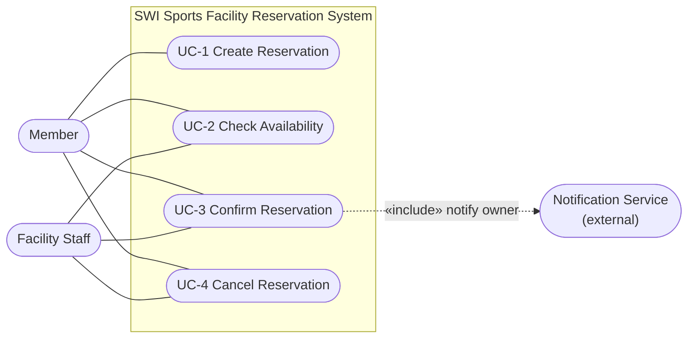
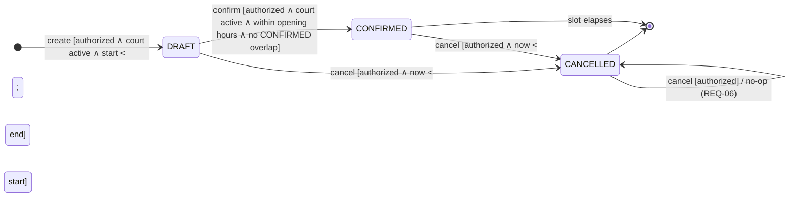
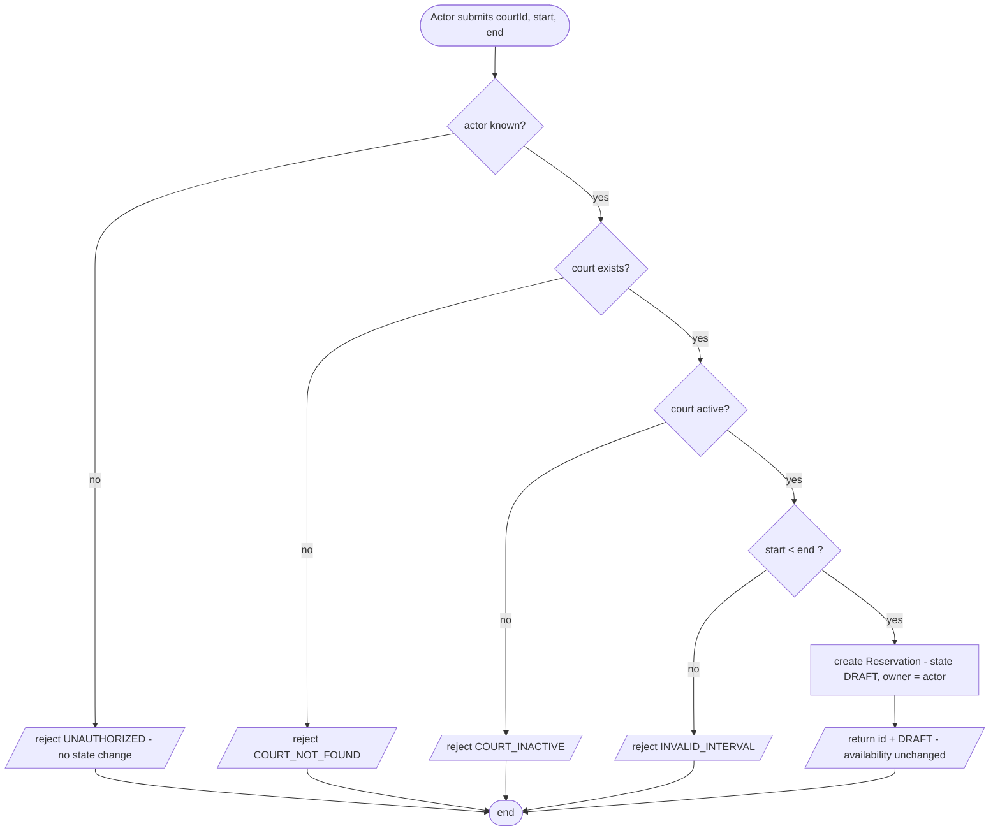
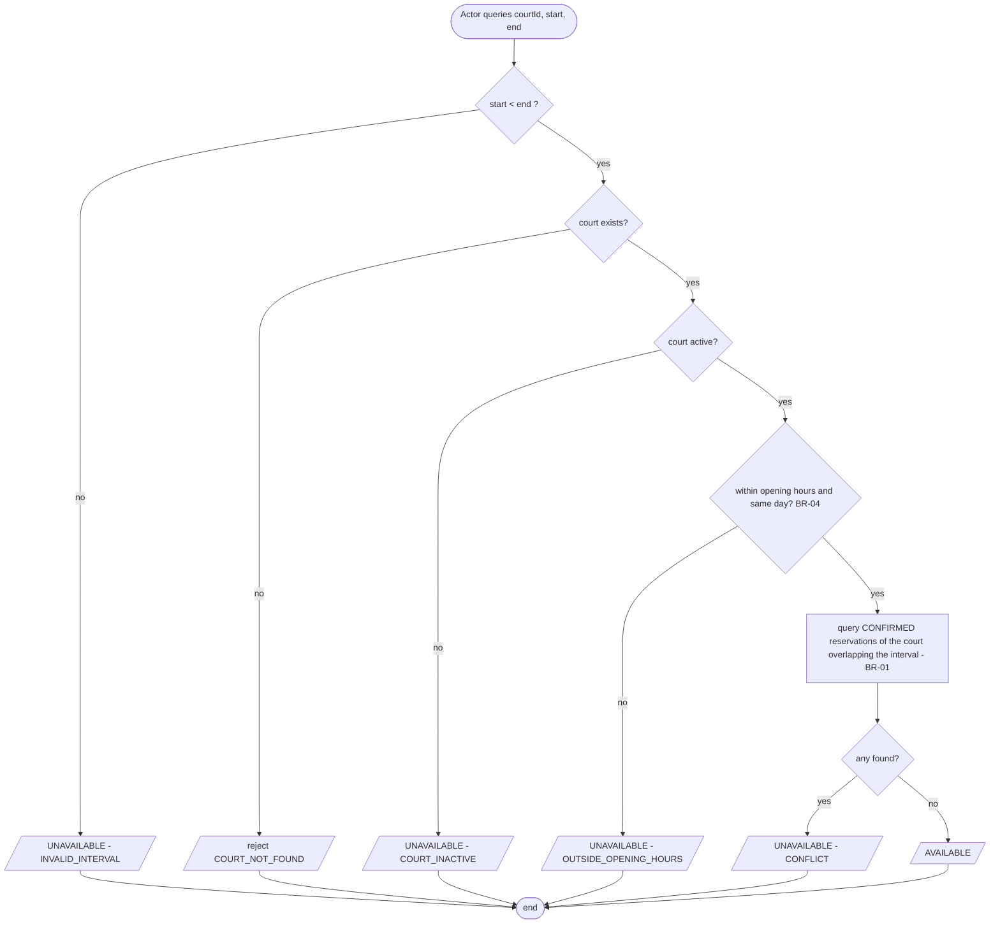
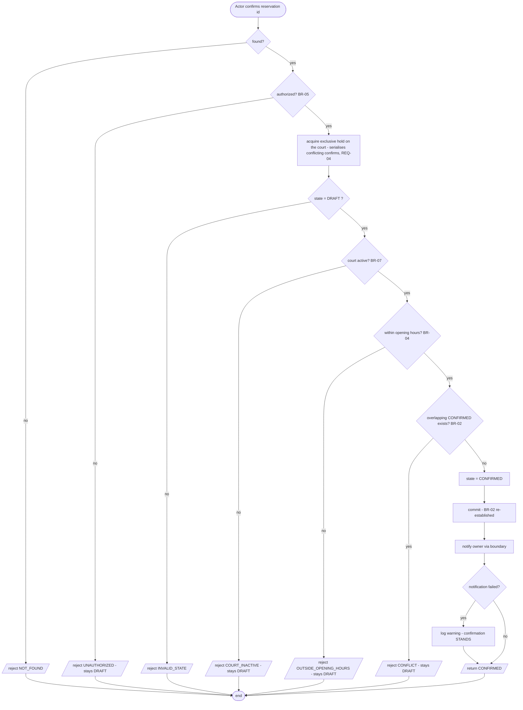
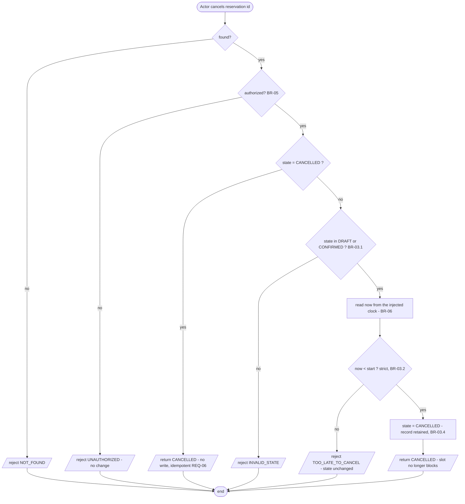

# C02 — Specification Baseline v0.1

**Scope:** the complete *minimum* behaviour of the SWI Sports Facility Reservation
System: **Create Reservation**, **Check Availability**, **Confirm Reservation**,
**Cancel Reservation**.

**Status:** ✅ **Specification Baseline v0.1 — Accepted by Team** (see §9.3).

**Builds on C01.** The domain (Court / AppUser / Reservation), the purpose, the
stakeholders and the two business rules were established in
[`intent-and-change.md`](intent-and-change.md). This document does not restate
them; it *specifies* the behaviour that C01 only named.

> `Approve` does **not** exist in Baseline v0.1. It is introduced by the C02
> change in [`c02-change-v0.2-approval.md`](c02-change-v0.2-approval.md).

---

## 0. Glossary — terms used with a fixed meaning

| Term | Meaning in this specification |
| --- | --- |
| **Resource** | A `Court`. Exclusive: at most one party may use it at a time. |
| **Court.active** | A court that may currently take new bookings. An inactive court (maintenance, withdrawn) still exists and still holds its history. |
| **Reservation** | A request by one `AppUser` to use one `Court` over one interval, carrying a lifecycle state. |
| **Actor** | The `AppUser` performing the operation. Distinct from the reservation's **owner**. |
| **Owner** | The `AppUser` the reservation was created for. |
| **Allocated / blocks the court** | The reservation counts against BR-02, i.e. it prevents another reservation from becoming CONFIRMED over the same interval. In v0.1 **only CONFIRMED reservations block**. |
| **Committed state** | State visible after a transaction commits. Invariants are asserted on committed state, not on intermediate in-transaction state. |
| **Facility time** | Wall-clock time at the facility. See BR-06. |
| **now** | The current facility time, read **once** per operation from the injected clock. |

---

## 1. Shared business rules and invariants

Defined once here; the slices in §3–§6 reference them by id and never redefine them.

### BR-01 — Interval semantics
An interval is **half-open**: `[start, end)`. `start` is included, `end` is excluded.

- An interval is **valid** iff `start < end` (strictly). `start == end` is invalid.
- Two intervals **overlap** iff `a.start < b.end && b.start < a.end`.
- Consequence: `[10:00,11:00)` and `[11:00,12:00)` do **not** overlap — back-to-back
  bookings are legal.
- Both bounds are `LocalDateTime` in facility time (BR-06).

### BR-02 — Exclusive-resource invariant *(the common rule from C01)*
> **At no committed state may two CONFIRMED reservations of the same court overlap.**

- Only the state `CONFIRMED` participates. `DRAFT` and `CANCELLED` do not block.
- This is an **invariant**, not a step: it must hold after *every* committed
  transaction, including under concurrency (REQ-04).

### BR-03 — Cancellation policy *(team-defined)*
1. **Cancellable source states:** `DRAFT` and `CONFIRMED`.
2. **Time boundary:** cancellation is allowed only while `now < reservation.start`,
   evaluated strictly. `now == start` is **too late** → rejected. The boundary is
   evaluated against the reservation's *start*, never its end.
3. **Repeated cancel is idempotent:** cancelling a reservation already in
   `CANCELLED` **succeeds** and returns `CANCELLED`. It performs no state change,
   emits no new event, and does **not** re-check the time boundary — a
   reservation that was validly cancelled stays cancellable-reported forever.
   *Rationale:* a client retrying after a lost response must not receive an error
   for an outcome that already holds.
4. **Cancel is not Delete.** The record is retained with `state = CANCELLED`; only
   its *blocking effect* (BR-02) is removed. Cancellation history stays auditable.
5. **Cancel vs Confirm race:** both operations serialise on the same court
   (REQ-04). Whichever commits first wins; the loser sees the new source state and
   is rejected by its own source-state guard. A `CANCELLED` reservation can never
   later become `CONFIRMED`.

### BR-04 — Opening-hours rule *(the domain-specific rule from C01)*
A reservation's interval must lie entirely within its court's opening hours and
within a single calendar day:

`start.date == end.date` **and** `start.time >= court.openingTime` **and**
`end.time <= court.closingTime`.

A slot spanning midnight is rejected. Enforced at **Confirm** (REQ-03) and
reported by **Check Availability** (REQ-02).

### BR-05 — Authorization *(minimum model)*
- Every state-changing operation carries an **actor** — a known `AppUser`. An
  unknown actor id is **unauthorized**.
- `AppUser.role ∈ {MEMBER, STAFF}`.
- A **MEMBER** may create reservations for themselves and may confirm/cancel only
  reservations they own.
- **STAFF** may confirm/cancel any reservation.
- *Assumption (A-1):* authentication itself is out of scope in C02 — the actor id
  is supplied by the caller and trusted. See §10.

### BR-06 — Time and clock
The facility operates in **one time zone**; all `LocalDateTime` values are facility
time and are directly comparable (C01 assumption, carried forward). The system
reads time from a **single injected clock**, never from ambient `now()` calls
scattered through the logic, so that time-boundary behaviour (BR-03.2) is
observable and testable.

### BR-07 — Court activity
A reservation may only be **created** for and **confirmed** on a court with
`active = true`. Deactivating a court does not retroactively cancel reservations
that are already CONFIRMED.

---

## 2. Requirement register

| id | Requirement (one sentence) | Rules |
| --- | --- | --- |
| **REQ-01** | The system shall create a `DRAFT` reservation for an existing active court when the actor is authorized and the requested interval is valid. | BR-01, BR-05, BR-07 |
| **REQ-02** | For a valid interval, the system shall report an exclusive court as UNAVAILABLE when the interval overlaps an existing CONFIRMED reservation of that court, or lies outside the court's opening hours, or the court is inactive; otherwise AVAILABLE. | BR-01, BR-02, BR-04, BR-07 |
| **REQ-03** | The system shall confirm a `DRAFT` reservation only when the actor is authorized, the court is active, the interval lies within opening hours, and the interval does not overlap an existing CONFIRMED reservation of that court. | BR-01, BR-02, BR-04, BR-05, BR-07 |
| **REQ-04** | For concurrent conflicting confirmation attempts on the same court, at most one reservation shall reach CONFIRMED. | BR-02 |
| **REQ-05** | The system shall allow a `DRAFT` or `CONFIRMED` reservation to be cancelled by an authorized actor while `now < start`, after which it no longer blocks availability. | BR-01, BR-03, BR-05, BR-06 |
| **REQ-06** | Cancelling a reservation that is already `CANCELLED` shall succeed and report `CANCELLED`, without a further state change. | BR-03.3 |
| **REQ-07** | Every state-changing operation shall reject an actor who is unknown, or who is a MEMBER acting on a reservation they do not own, without changing any state. | BR-05 |
| **REQ-08** | A confirmation whose interval falls outside the court's opening hours or spans a calendar-day boundary shall be rejected. | BR-04 |

---

## 3. OP-01 — Create Reservation

**Goal / user value:** a member can stake a claim on a court slot and obtain a
reference for it, *before* the system commits the court to them — so the member
can assemble a booking (pick a slot, check with a partner) without racing others
into an irreversible allocation.

**Trigger:** an actor submits `courtId`, `start`, `end`.

**Observable requirement(s):** REQ-01, REQ-07.

**Preconditions:**
- actor is a known `AppUser` (BR-05);
- court `courtId` exists and `active = true` (BR-07);
- `start < end` (BR-01).

**Success postcondition:**
- exactly one new reservation exists with `state = DRAFT`, `owner = actor`;
- the reservation has a system-assigned identifier;
- **no court allocation is committed** — the court's availability (REQ-02) is
  unchanged by this operation.

**State change:** `∅ → DRAFT`.

**Referenced business rule(s) / invariant(s):** BR-01, BR-05, BR-07.

### Main success scenario
1. Actor submits `courtId` and the interval `[start, end)`.
2. System validates the actor is known and authorized (BR-05).
3. System validates the court exists and is active (BR-07).
4. System validates `start < end` (BR-01).
5. System creates a reservation in `DRAFT` owned by the actor.
6. System returns the identifier and the state `DRAFT`.

### Alternative / failure outcomes
| # | Condition | Outcome |
| --- | --- | --- |
| A1 | unknown actor | reject `UNAUTHORIZED`; **no reservation created** |
| A2 | unknown `courtId` | reject `COURT_NOT_FOUND`; no create |
| A3 | court exists but `active = false` | reject `COURT_INACTIVE`; no create |
| A4 | `start == end` | reject `INVALID_INTERVAL`; no create |
| A5 | `start > end` | reject `INVALID_INTERVAL`; no create |

> **Deliberately *not* a failure of OP-01:** an interval that overlaps a CONFIRMED
> reservation, and an interval outside opening hours. Create is a *claim*, not an
> allocation; those are Confirm's guards (REQ-03). Two members may hold DRAFTs on
> the same slot — see §9.1 C-1.

### Verification examples
| id | Given | When | Then |
| --- | --- | --- | --- |
| V-01.1 | active court, known member, `[10:00,11:00)` | create | `state = DRAFT`, id assigned |
| V-01.2 | as V-01.1, plus an existing CONFIRMED `[10:00,11:00)` | create | `state = DRAFT` (create never checks overlap) |
| V-01.3 | `start = end = 10:00` | create | rejected `INVALID_INTERVAL`, reservation count unchanged |
| V-01.4 | `courtId` unknown | create | rejected `COURT_NOT_FOUND` |
| V-01.5 | unknown actor id | create | rejected `UNAUTHORIZED` |
| V-01.6 | court with `active = false` | create | rejected `COURT_INACTIVE` |

**Rationale / source:** C01 Project Frame, "Create reservation — register a new
booking as DRAFT"; C02 §A.4 detailed reference.

**Assumption / unknown / TBD:** A-6 (whether a member may hold several concurrent
reservations) would add a guard here; unresolved, see §10.

---

## 4. OP-02 — Check Availability

**Goal / user value:** a member can see whether a slot can *actually* be booked
before investing effort in creating and confirming it; staff can answer "is court
3 free at 18:00?" without reading the reservation list.

**Trigger:** an actor queries `courtId` + `[start, end)`.

**Observable requirement(s):** REQ-02.

**Preconditions:** court `courtId` exists. (No authorization precondition:
availability is not private information — see §9.1 C-5.)

**Success postcondition:** a boolean `available` is returned together with the
**reason** when unavailable. **No state is changed** — this operation is a pure
query.

**State change:** none.

**Referenced business rule(s) / invariant(s):** BR-01, BR-02, BR-04, BR-07.

### Main success scenario
1. Actor submits `courtId` and `[start, end)`.
2. System validates the interval (BR-01) and that the court exists.
3. System evaluates, in order: court active (BR-07) → within opening hours (BR-04)
   → no overlapping CONFIRMED reservation (BR-02).
4. System returns `AVAILABLE`, or `UNAVAILABLE` with the first failing reason.

### Alternative / failure outcomes
| # | Condition | Outcome |
| --- | --- | --- |
| B1 | `start >= end` | `UNAVAILABLE`, reason `INVALID_INTERVAL` |
| B2 | unknown `courtId` | reject `COURT_NOT_FOUND` (an error, not "unavailable" — an answer about a non-existent court would be fabricated) |
| B3 | court inactive | `UNAVAILABLE`, reason `COURT_INACTIVE` |
| B4 | outside opening hours / spans midnight | `UNAVAILABLE`, reason `OUTSIDE_OPENING_HOURS` |
| B5 | overlaps a CONFIRMED reservation | `UNAVAILABLE`, reason `CONFLICT` |

### Verification examples
**Accepted interval semantics: `[start, end)` (BR-01).**
Fixture: court open 08:00–22:00, one existing **CONFIRMED** `[10:00, 11:00)`.

| id | Query | Expected | Why |
| --- | --- | --- | --- |
| V-02.1 | `[09:00, 10:00)` | **AVAILABLE** | ends exactly where the booking starts — no overlap (BR-01) |
| V-02.2 | `[10:30, 11:30)` | **UNAVAILABLE / CONFLICT** | partial overlap |
| V-02.3 | `[11:00, 12:00)` | **AVAILABLE** | starts exactly where the booking ends — no overlap (BR-01) |
| V-02.4 | `[10:00, 11:00)` | **UNAVAILABLE / CONFLICT** | identical interval |
| V-02.5 | `[09:30, 11:30)` | **UNAVAILABLE / CONFLICT** | strictly contains the booking |
| V-02.6 | `[07:00, 08:30)` | **UNAVAILABLE / OUTSIDE_OPENING_HOURS** | starts before opening (BR-04) |
| V-02.7 | `[21:30, 22:30)` | **UNAVAILABLE / OUTSIDE_OPENING_HOURS** | ends after closing (BR-04) |
| V-02.8 | slot overlapped only by a **DRAFT** reservation | **AVAILABLE** | DRAFT does not block (BR-02) |
| V-02.9 | slot whose CONFIRMED reservation was **cancelled** | **AVAILABLE** | CANCELLED does not block (BR-02, BR-03.4) |
| V-02.10 | `[10:00, 10:00)` | **UNAVAILABLE / INVALID_INTERVAL** | empty interval (BR-01) |

**Rationale / source:** C01 "Check availability"; C02 §A.5 detailed reference.

**Assumption / unknown / TBD:** A-2 — an availability answer is advisory and may be
stale the instant it is returned; the guarantee lives at confirm time.

---

## 5. OP-03 — Confirm Reservation

**Goal / user value:** the member turns a claim into a guaranteed booking; from
this moment the facility owes them the court and nobody else can take it.

**Trigger:** an actor confirms an existing reservation by id.

**Observable requirement(s):** REQ-03, REQ-04, REQ-07, REQ-08.

**Preconditions:**
- reservation exists and `state = DRAFT` (BR-03.5 — a CANCELLED reservation is
  *not* confirmable);
- actor is authorized for it (BR-05);
- court is `active` (BR-07);
- interval within opening hours (BR-04);
- no overlapping CONFIRMED reservation for that court (BR-02).

**Success postcondition:**
- `reservation.state = CONFIRMED`;
- the reservation **blocks** the court for its interval (REQ-02 now answers
  `UNAVAILABLE / CONFLICT` for any overlapping query);
- BR-02 still holds over the whole committed state;
- the owner is notified through the Notification boundary — and a notification
  failure does **not** undo the confirmation (C01 ADR-3).

**State change:** `DRAFT → CONFIRMED`.

**Referenced business rule(s) / invariant(s):** BR-01, BR-02, BR-04, BR-05, BR-07.

### Main success scenario
1. Actor submits the reservation id.
2. System loads the reservation and checks the actor's authorization (BR-05).
3. System establishes an exclusive hold on the court so that the check and the
   write cannot be interleaved by another confirmation (REQ-04).
4. System checks `state = DRAFT`.
5. System checks the court is active (BR-07).
6. System checks the interval against opening hours (BR-04).
7. System checks that no CONFIRMED reservation of that court overlaps (BR-02).
8. System sets `state = CONFIRMED` and commits.
9. System notifies the owner; failure is logged, not propagated.
10. System returns the reservation with `state = CONFIRMED`.

### Alternative / failure outcomes
| # | Condition | Outcome |
| --- | --- | --- |
| C1 | reservation not found | reject `NOT_FOUND` |
| C2 | source state is `CONFIRMED` | reject `INVALID_STATE` — idempotency is **not** granted here (unlike Cancel); see §9.1 C-4 |
| C3 | source state is `CANCELLED` | reject `INVALID_STATE`; **stays CANCELLED** |
| C4 | unauthorized actor | reject `UNAUTHORIZED`; **stays DRAFT** |
| C5 | court inactive | reject `COURT_INACTIVE`; **stays DRAFT** |
| C6 | outside opening hours (REQ-08) | reject `OUTSIDE_OPENING_HOURS`; **stays DRAFT** |
| C7 | overlaps a CONFIRMED reservation | reject `CONFLICT`; **stays DRAFT** — the member may cancel it or confirm a different slot |
| C8 | two conflicting confirms in parallel (REQ-04) | exactly one commits `CONFIRMED`; every other one is rejected `CONFLICT` and **stays DRAFT** |
| C9 | notification boundary fails | confirmation **stands**; failure logged (C01 ADR-3) |

### Verification examples
| id | Given | When | Then |
| --- | --- | --- | --- |
| V-03.1 | DRAFT `[10:00,11:00)`, no conflict | confirm | `CONFIRMED`; availability of `[10:00,11:00)` becomes UNAVAILABLE |
| V-03.2 | CONFIRMED `[10:00,11:00)` exists; DRAFT `[10:30,11:30)` | confirm the draft | rejected `CONFLICT`; draft **remains DRAFT** |
| V-03.3 | CONFIRMED `[10:00,11:00)` exists; DRAFT `[11:00,12:00)` | confirm | `CONFIRMED` — a boundary touch is not a conflict (BR-01) |
| V-03.4 | DRAFT `[21:30,22:30)`, court closes 22:00 | confirm | rejected `OUTSIDE_OPENING_HOURS`; remains DRAFT |
| V-03.5 | DRAFT on an inactive court | confirm | rejected `COURT_INACTIVE`; remains DRAFT |
| V-03.6 | already CONFIRMED reservation | confirm again | rejected `INVALID_STATE` |
| V-03.7 | CANCELLED reservation | confirm | rejected `INVALID_STATE`; stays CANCELLED |
| V-03.8 | MEMBER B confirms MEMBER A's DRAFT | confirm | rejected `UNAUTHORIZED`; remains DRAFT |
| V-03.9 | **N = 8** DRAFTs on the same court, all `[10:00,11:00)`, confirmed from 8 threads simultaneously | confirm ×8 | **exactly 1** CONFIRMED, 7 rejected `CONFLICT`, BR-02 holds (REQ-04) |

**Rationale / source:** C01 "Confirm / approve reservation"; C02 §A.6 detailed
reference. V-03.9 realises the **future pressure (Q/Scale)** selected in C01
(`architecture-and-decisions.md`): check-then-act double booking.

**Assumption / unknown / TBD:** A-3 — v0.1 places no *lower* time bound on Confirm
(a past slot may be confirmed). Deliberate asymmetry with Cancel; unresolved.

---

## 6. OP-04 — Cancel Reservation

**Goal / user value:** a member who cannot come releases the court so someone else
can book it, and the facility stops holding capacity for a no-show.

**Trigger:** an actor cancels an existing reservation by id.

**Observable requirement(s):** REQ-05, REQ-06, REQ-07.

**Preconditions:**
- reservation exists;
- actor is authorized for it (BR-05);
- `state ∈ {DRAFT, CONFIRMED}` (BR-03.1);
- `now < reservation.start` (BR-03.2, BR-06).

**Success postcondition:**
- `reservation.state = CANCELLED`;
- the reservation **no longer blocks** availability — an overlapping slot that was
  `UNAVAILABLE / CONFLICT` becomes `AVAILABLE` (if nothing else blocks it);
- the reservation record still exists (BR-03.4 — cancel is not delete).

**State change:** `DRAFT → CANCELLED` or `CONFIRMED → CANCELLED`; and
`CANCELLED → CANCELLED` as a **no-op success** (REQ-06).

**Referenced business rule(s) / invariant(s):** BR-01, BR-03, BR-05, BR-06.

### Main success scenario
1. Actor submits the reservation id.
2. System loads the reservation and checks the actor's authorization (BR-05).
3. If `state = CANCELLED`, system returns `CANCELLED` immediately (REQ-06) — **no**
   time-boundary check, **no** state write.
4. System checks `state ∈ {DRAFT, CONFIRMED}` (BR-03.1).
5. System reads `now` from the clock (BR-06) and checks `now < start` (BR-03.2).
6. System sets `state = CANCELLED` and commits.
7. System returns the reservation with `state = CANCELLED`.

### Alternative / failure outcomes
| # | Condition | Outcome |
| --- | --- | --- |
| D1 | reservation not found | reject `NOT_FOUND` |
| D2 | unauthorized actor | reject `UNAUTHORIZED`; state unchanged |
| D3 | already `CANCELLED` | **success**, returns `CANCELLED` (REQ-06) — *not* an error |
| D4 | `now == start` | reject `TOO_LATE_TO_CANCEL` — the boundary is strict (BR-03.2) |
| D5 | `now > start` (slot running or past) | reject `TOO_LATE_TO_CANCEL` |
| D6 | concurrent Confirm on the same reservation | serialised (REQ-04); the second operation sees the committed new state and is rejected by its own source-state guard |

### Verification examples
The fixture clock is fixed so the boundary is exactly observable (BR-06).

| id | Given | When | Then |
| --- | --- | --- | --- |
| V-04.1 | DRAFT `[10:00,11:00)`, now = 09:00 | cancel | `CANCELLED` |
| V-04.2 | CONFIRMED `[10:00,11:00)`, now = 09:00 | cancel, then check availability `[10:00,11:00)` | `CANCELLED`, and the slot is **AVAILABLE** again |
| V-04.3 | already CANCELLED, now = 09:00 | cancel again | **success**, `CANCELLED` (REQ-06), no second state change |
| V-04.4 | CONFIRMED `[10:00,11:00)`, **now = 10:00 exactly** | cancel | rejected `TOO_LATE_TO_CANCEL`; **remains CONFIRMED** (boundary, BR-03.2) |
| V-04.5 | CONFIRMED `[10:00,11:00)`, now = 10:30 | cancel | rejected `TOO_LATE_TO_CANCEL`; remains CONFIRMED |
| V-04.6 | MEMBER B cancels MEMBER A's reservation | cancel | rejected `UNAUTHORIZED`; state unchanged |
| V-04.7 | STAFF cancels MEMBER A's reservation, now = 09:00 | cancel | `CANCELLED` (BR-05) |
| V-04.8 | cancelled reservation | look it up | the record still exists with `state = CANCELLED` (BR-03.4) |

**Rationale / source:** C01 "Cancel reservation"; C02 §A.7 — the exercise supplies
only an *example* policy, so §1 BR-03 is the team's own accepted policy, and the
four open questions (§A.7 "Decide") are answered in BR-03.1–BR-03.5.

**Assumption / unknown / TBD:** A-5 — whether the facility wants a cancellation
notice period (e.g. no cancellation within 2 h of start). Not supplied by any
stakeholder, so it is recorded as unknown rather than invented.

---

## 7. Requirement acceptance gate

Applied to every accepted requirement. A requirement that could not answer all
nine lines was rewritten before acceptance (see §9.2).

### REQ-01 — Create → DRAFT
| Question | Answer |
| --- | --- |
| Meaning | "Authorized" = known `AppUser` (BR-05); "valid interval" = `start < end` (BR-01); "existing Resource" = court exists **and** `active` (BR-07). |
| Need / rationale | Members must be able to assemble a booking without racing for allocation; a reference id is needed for every later operation. |
| Observable | Yes — "a reservation with state DRAFT and an id exists, and availability is unchanged". No storage, framework or layering is prescribed. |
| Feasible | Yes; it deliberately claims *less* than Confirm, so it cannot conflict with BR-02. |
| Verifiable | V-01.1 … V-01.6. |
| State / time | Depends on court state (`active`) at create time. Not time-boundary sensitive: a DRAFT may be created for a past slot — Confirm and Cancel carry the time guards. |
| Concurrency | No business impact: parallel creates produce independent DRAFTs, and DRAFTs do not block (BR-02). |
| Consistency | Agrees with OP-02 (a DRAFT leaves availability untouched, V-02.8) and with the statechart's single `create` entry edge. |
| Unknown? | A-1 (authentication out of scope) and A-6 (multiple concurrent reservations) are recorded, not hidden. |

### REQ-02 — Availability
| Question | Answer |
| --- | --- |
| Meaning | AVAILABLE = the interval is valid, the court is active and open, and no CONFIRMED reservation of that court overlaps it. Overlap per BR-01. |
| Need / rationale | Without it a member can only discover a conflict by failing to confirm; staff need a direct answer. |
| Observable | Yes — a boolean plus a reason code. The reason is part of the requirement because "unavailable" alone is not actionable. |
| Feasible | Yes; it is a read-only projection of the same predicate Confirm enforces. |
| Verifiable | V-02.1 … V-02.10, including both interval boundaries. |
| State / time | Depends on committed CONFIRMED reservations **at query time**; the answer is a snapshot, explicitly **not** a hold (A-2). |
| Concurrency | Yes — an AVAILABLE answer can be stale the instant it is returned. Accepted: availability is advisory; the guarantee is REQ-03/REQ-04 at confirm time. Recorded as A-2. |
| Consistency | The blocking set `{CONFIRMED}` is identical to BR-02's and to OP-03 step 7. Checked in §9.1 C-2. |
| Unknown? | A-2 explicit. |

### REQ-03 — Confirm guards
| Question | Answer |
| --- | --- |
| Meaning | Each guard is defined by a referenced rule: source state DRAFT, BR-05, BR-07, BR-04, BR-02. |
| Need / rationale | This is the operation that commits the facility's capacity; every guard prevents a promise the facility cannot keep. |
| Observable | Yes — `state = CONFIRMED` + availability flips to UNAVAILABLE; on failure, state **unchanged**. "Stays DRAFT" is deliberately part of the requirement. |
| Feasible | Yes, together with REQ-04 (which constrains *how strongly* the check must hold, not what it checks). |
| Verifiable | V-03.1 … V-03.8. |
| State / time | Strongly state-dependent (source state + other reservations' states). Deliberately **not** time-boundary dependent: confirming a past slot is allowed in v0.1 — recorded as A-3. |
| Concurrency | Yes, decisively — split out as REQ-04 rather than left implicit. |
| Consistency | Guard set matches the statechart's `confirm` guard and OP-02's predicate. |
| Unknown? | A-3 explicit. |

### REQ-04 — Concurrency
| Question | Answer |
| --- | --- |
| Meaning | "Conflicting" = same court, overlapping intervals per BR-01. "At most one" = over the committed state, never two. |
| Need / rationale | BR-02 is the reason the system exists; a check-then-act sequence violates it under load (C01 selected future pressure, Q/Scale). |
| Observable | Yes — after N parallel confirms of the same slot, count(CONFIRMED) ≤ 1 and every loser is still DRAFT. |
| Feasible | Yes; it constrains the outcome, not the mechanism. A lock, a unique/exclusion constraint or serializable isolation all satisfy it. |
| Verifiable | V-03.9 (N = 8 threads). |
| State / time | It is precisely about interleaving: the check and the write must not be separable by another transaction's commit. |
| Concurrency | This *is* the concurrency requirement. |
| Consistency | Strengthens BR-02 rather than adding a new rule; does not alter any other slice's outcome in the single-threaded case. |
| Unknown? | The *mechanism* is deliberately unspecified — an architecture decision carried to C03 as driver **AD-1** (§11). |

### REQ-05 — Cancel before start
| Question | Answer |
| --- | --- |
| Meaning | Cancellable source states DRAFT/CONFIRMED (BR-03.1); "before start" is `now < start`, strict (BR-03.2); `now` from the injected clock (BR-06). |
| Need / rationale | Releases capacity for other members; the boundary stops a member walking away after the slot has begun. |
| Observable | Yes — state becomes CANCELLED and the slot becomes AVAILABLE again. |
| Feasible | Yes; consistent with BR-02, which simply stops counting the reservation. |
| Verifiable | V-04.1, V-04.2, V-04.7 (success); V-04.4, V-04.5 (boundary/failure). |
| State / time | Both. The `now == start` case is called out explicitly precisely because interval boundaries are where specifications usually equivocate. |
| Concurrency | Cancel vs Confirm race is resolved by BR-03.5 + REQ-04: serialised, first commit wins, loser rejected on source state. |
| Consistency | Matches the statechart's two `cancel` edges and OP-02's non-blocking set. |
| Unknown? | A-5 (notice period) is explicit; the four "Decide" questions from the exercise are all answered in BR-03. |

### REQ-06 — Cancel idempotency
| Question | Answer |
| --- | --- |
| Meaning | A cancel on a `CANCELLED` reservation returns success with `CANCELLED`, writes nothing, and skips the time boundary. |
| Need / rationale | Clients retry on timeouts; returning an error for an already-achieved outcome makes retries unsafe and produces false alarms. |
| Observable | Yes — same response as the first cancel; the stored state and the cancellation timestamp are unchanged. |
| Feasible | Yes. It is deliberately asymmetric with Confirm (C2) — justified in §9.1 C-4. |
| Verifiable | V-04.3. |
| State / time | Skipping the time check is **intentional**: a reservation validly cancelled at 09:00 must still answer "CANCELLED" when the retry lands at 10:05. |
| Concurrency | Two simultaneous cancels both succeed and both report CANCELLED; only one write occurs. No invariant is touched. |
| Consistency | The statechart shows `CANCELLED --cancel--> CANCELLED` as an explicit self-transition, so the diagram does not contradict the text. |
| Unknown? | None. |

### REQ-07 — Authorization
| Question | Answer |
| --- | --- |
| Meaning | Unknown actor → UNAUTHORIZED; MEMBER limited to owned reservations; STAFF unrestricted (BR-05). |
| Need / rationale | Otherwise any caller could cancel another member's confirmed booking. |
| Observable | Yes — rejection **plus** the assertion that no state changed. |
| Feasible | Yes, under A-1 (identity is asserted, not authenticated). |
| Verifiable | V-01.5, V-03.8, V-04.6, V-04.7. |
| State / time | The role is read at operation time; a later role change does not retroactively invalidate past operations. |
| Concurrency | None. |
| Consistency | Applied in OP-01/03/04 and deliberately **not** in OP-02 — justified in §9.1 C-5. |
| Unknown? | A-1 explicit: real authentication is a C03+ concern, driver **AD-3**. |

### REQ-08 — Opening hours
| Question | Answer |
| --- | --- |
| Meaning | BR-04, including the single-calendar-day clause; `end.time == closingTime` is allowed (half-open, BR-01). |
| Need / rationale | C01 domain rule: the facility is staffed and lit only during opening hours. |
| Observable | Yes — confirm rejected, state stays DRAFT; availability reports `OUTSIDE_OPENING_HOURS`. |
| Feasible | Yes. |
| Verifiable | V-03.4, V-02.6, V-02.7. |
| State / time | Depends on the court's opening hours **as configured at evaluation time**; changing opening hours does not retroactively invalidate CONFIRMED reservations — recorded as A-4. |
| Concurrency | None. |
| Consistency | Enforced in OP-03 and reported in OP-02, so the two views agree (§9.1 C-3). |
| Unknown? | A-4 explicit. |

---

## 8. Views

### 8a. Use-case / actor-goal view

The system boundary encloses exactly the four core goals of Baseline v0.1.

```
                       SWI Sports Facility Reservation System
              ┌───────────────────────────────────────────────────┐
              │                                                   │
              │        ( UC-1  Create Reservation )               │
  ┌────────┐  │                                                   │
  │ Member ├──┼────────( UC-2  Check Availability )               │
  └────────┘  │                                                   │
              │        ( UC-3  Confirm Reservation ) ┄┄«include»┄┄┼──┐
  ┌──────────┐│                                                   │  │   ┌────────────────┐
  │ Facility ├┼────────( UC-4  Cancel Reservation )               │  └──>│  Notification  │
  │  Staff   ││                                                   │      │    Service     │
  └──────────┘└───────────────────────────────────────────────────┘      │   (external)   │
                                                                         └────────────────┘
```

| Actor | Kind | Goals |
| --- | --- | --- |
| **Member** | primary, human | UC-1 Create, UC-2 Check Availability, UC-3 Confirm (own), UC-4 Cancel (own) |
| **Facility Staff** | primary, human | UC-2 Check Availability, UC-3 Confirm (any), UC-4 Cancel (any) — BR-05 |
| **Notification Service** | supporting, external system | receives the confirmation message from UC-3 (the C01 system boundary — a *real* dependency, not decoration) |

No other external actor is included: no payment, no calendar sync, and no approver
— the approver arrives only with the v0.2 change.

Mermaid rendering of the same view:



### 8b. Reservation lifecycle statechart



**Guard ↔ text traceability** — every edge maps to a slice and a rule:

| Edge | Guard | Slice | Rules |
| --- | --- | --- | --- |
| `[*] → DRAFT` | authorized ∧ court exists & active ∧ `start < end` | OP-01 | BR-01, BR-05, BR-07 |
| `DRAFT → CONFIRMED` | authorized ∧ active ∧ BR-04 ∧ ¬∃ overlapping CONFIRMED | OP-03 | BR-01, BR-02, BR-04, BR-05, BR-07 |
| `DRAFT → CANCELLED` | authorized ∧ `now < start` | OP-04 | BR-03, BR-05, BR-06 |
| `CONFIRMED → CANCELLED` | authorized ∧ `now < start` | OP-04 | BR-03, BR-05, BR-06 |
| `CANCELLED → CANCELLED` | authorized | OP-04 (REQ-06) | BR-03.3 |

**Absent edges are claims too.** There is no `CANCELLED → CONFIRMED`, no
`CONFIRMED → DRAFT` and no `CONFIRMED → CONFIRMED`. They correspond exactly to
failure outcomes C3, (no un-confirm operation exists) and C2.

### 8c. Activity flows

**OP-01 Create Reservation**


**OP-02 Check Availability**


**OP-03 Confirm Reservation**


**OP-04 Cancel Reservation**


---

## 9. Cross-slice and cross-view consistency review

The specification was reviewed as **one system of claims**, not as four
independent documents.

### 9.1 Findings and resolutions

| id | Check | Finding | Resolution |
| --- | --- | --- | --- |
| **C-1** | Create vs Confirm allocation semantics | Ambiguity: does Create reserve the slot? If it did, two members could not both draft the same slot, and DRAFT would have to block. | **Resolved:** Create is a *claim*, not an allocation (OP-01 postcondition states "no allocation is committed"). Overlap is deliberately **not** an OP-01 failure. Consequence accepted and documented: several DRAFTs may exist for the same slot, and the first to confirm wins (V-03.9). |
| **C-2** | Availability vs Confirm blocking states | Both must use the *same* blocking set, or a slot could report AVAILABLE and then fail to confirm. | **Verified:** both use exactly `{CONFIRMED}`. BR-02, OP-02 step 3, OP-03 step 7 and the statechart all name the same single state. |
| **C-3** | Availability vs Confirm guard set | OP-02 initially reported only overlap while OP-03 also enforced opening hours and court activity — so a slot outside opening hours would report AVAILABLE and then fail to confirm. | **Fixed in the spec:** REQ-02 widened to include BR-04 and BR-07, with reasons `OUTSIDE_OPENING_HOURS` / `COURT_INACTIVE` (V-02.6, V-02.7). *(This check also produced implementation mismatch M-1, see the evidence file.)* |
| **C-4** | Cancel idempotent but Confirm not — inconsistent? | Apparent asymmetry between REQ-06 and outcome C2. | **Accepted as intentional and justified:** a repeated Cancel can only be the same party re-asserting an outcome that already holds. A repeated Confirm may be a *different* party's attempt on a slot that is already taken; answering "success" would tell them they hold a booking they do not own. Recorded so it is a decision, not an oversight. |
| **C-5** | Authorization applied to 3 of 4 operations | OP-02 has no authorization precondition while OP-01/03/04 do. | **Accepted as intentional:** availability of a public sports court is not private information, and requiring identity to ask "is court 3 free?" would block the main pre-booking use case. Stated as a precondition-free slice rather than left silent. |
| **C-6** | Cancel vs statechart | The statechart had no representation of the idempotent repeat cancel, so the diagram implied a repeat was impossible while the text said it succeeded. | **Fixed:** the explicit self-transition `CANCELLED --cancel--> CANCELLED / no-op` was added to §8b. |
| **C-7** | Interval semantics consistency | `[start,end)` must be used identically in BR-01, overlap, opening hours and every example. | **Verified:** V-02.1 / V-02.3 (touching intervals available) and V-03.3 (touching confirm succeeds) pin the semantics from both sides; BR-04 uses `end.time <= closingTime`, the same half-open convention. |
| **C-8** | Actor goals vs slices | Every use case in §8a must have a slice, and every slice an actor. | **Verified:** UC-1↔OP-01, UC-2↔OP-02, UC-3↔OP-03, UC-4↔OP-04. The Notification Service appears in OP-03 only, matching the C01 boundary. No orphan goal, no unreachable slice. |
| **C-9** | Design leakage | Requirements must state outcomes, not prescribe structure. | **Fixed:** REQ-04 originally read "the service shall take a pessimistic lock on the court row" — a mechanism, not an outcome. Rewritten as "at most one reaches CONFIRMED"; the mechanism moved to architecture driver **AD-1** for C03. OP-03 step 3 likewise names the *property* (exclusive hold), not the lock type. |
| **C-10** | Fabricated precision | Any number or limit must have a source. | **Fixed:** an earlier draft of BR-03 said "cancellation is allowed up to 2 hours before start". No stakeholder supplied that figure. Replaced with the boundary the team can actually justify (`now < start`), and the open question recorded as **A-5** (§10). |
| **C-11** | Time-boundary consistency | `now == start` must resolve the same way everywhere. | **Verified:** BR-03.2 (strict), the OP-04 precondition, outcome D4 and V-04.4 all reject it; the statechart guard reads `now < start`. |
| **C-12** | Terminal-state claims | The statechart must not permit a transition the text forbids. | **Verified:** no `CANCELLED → CONFIRMED` edge exists, matching C3 and BR-03.5. |

### 9.2 Requirements rewritten during the gate

- **REQ-02** widened (finding C-3) so availability and confirm cannot disagree.
- **REQ-04** de-prescribed (finding C-9) — outcome instead of mechanism.
- **BR-03** de-fabricated (finding C-10) — the invented 2-hour window removed.
- **REQ-06** added: the exercise's "repeated Cancel: idempotent or reject?" was an
  open decision; leaving it unanswered would have failed the *Unknown?* gate line.

### 9.3 Acceptance

All twelve consistency checks are closed. All eight requirements pass all nine
gate lines. Remaining uncertainty is recorded explicitly in §10, not resolved by
invention.

> ### ✅ Specification Baseline v0.1 — Accepted by Team
> **Team:** Holy Trio — Pavel Valošek, Rostislav Nevoral, Pavel Mynář
> **Scope accepted:** BR-01…BR-07, REQ-01…REQ-08, OP-01…OP-04, §8a use-case view,
> §8b statechart, §8c activity flows.
> **Explicitly out of scope of v0.1:** approval workflow, payment, recurring
> bookings, quotas, multi-court bookings, authentication.

---

## 10. Assumptions, unknowns and TBDs

Recorded only where genuinely unresolved.

| id | Kind | Statement | Impact if wrong |
| --- | --- | --- | --- |
| **A-1** | Assumption | The actor's identity is supplied by the caller and trusted; authentication is out of scope in C02. | Authorization (REQ-07) is enforced but not *established*. Becomes architecture driver **AD-3**. |
| **A-2** | Assumption | An availability answer is advisory and may be stale the moment it is returned; the real guarantee is at confirm time. | If stakeholders expect "available" to hold the slot, a short-lived hold/quote concept would be needed — a new operation, not a tweak. |
| **A-3** | Assumption | Confirming a reservation whose slot lies in the past is permitted in v0.1 (no lower time bound on Confirm). | If the facility wants it blocked, add a guard to OP-03 mirroring BR-03.2. Flagged because Cancel *does* have a time boundary, so the asymmetry is deliberate rather than overlooked. |
| **A-4** | Assumption | Changing a court's opening hours does not retroactively invalidate already-CONFIRMED reservations. | Would require a re-validation sweep whenever opening hours change. |
| **A-5** | Unknown | Whether the facility wants a **cancellation notice period** (e.g. "no cancellation within 2 hours of start") and/or a no-show penalty. Not supplied by any stakeholder. | BR-03.2 would change from `now < start` to `now < start − noticePeriod`. Isolated to one named rule, so the impact is contained — that containment is why the boundary was written as a single rule. |
| **A-6** | Unknown | Whether a member may hold several concurrent reservations, or whether a fair-use quota applies (carried over from C01). | Would add a new business rule and a new Create guard. |

---

## 11. Architecture drivers discovered (input to C03)

Specification work surfaced these; **C02 does not solve them.**

| id | Driver | Source | Why it is architectural |
| --- | --- | --- | --- |
| **AD-1** | The BR-02 invariant must survive concurrent confirmation (REQ-04). | REQ-04, V-03.9, C01 future pressure Q/Scale | The correctness guarantee cannot live in application code alone — it needs a placement decision (DB constraint vs lock vs serializable isolation) that determines transaction boundaries, failure modes and scalability. |
| **AD-2** | Time must be injectable, not ambient. | BR-06, REQ-05, V-04.4 | A hard-coded `now()` makes boundary behaviour untestable and couples the domain to the runtime environment. |
| **AD-3** | Actor identity must be established, not asserted. | A-1, REQ-07 | Introduces an authentication boundary and changes every operation's entry signature. |

---

*End of Specification Baseline v0.1. The C02 change and Baseline v0.2 continue in
[`c02-change-v0.2-approval.md`](c02-change-v0.2-approval.md).*
