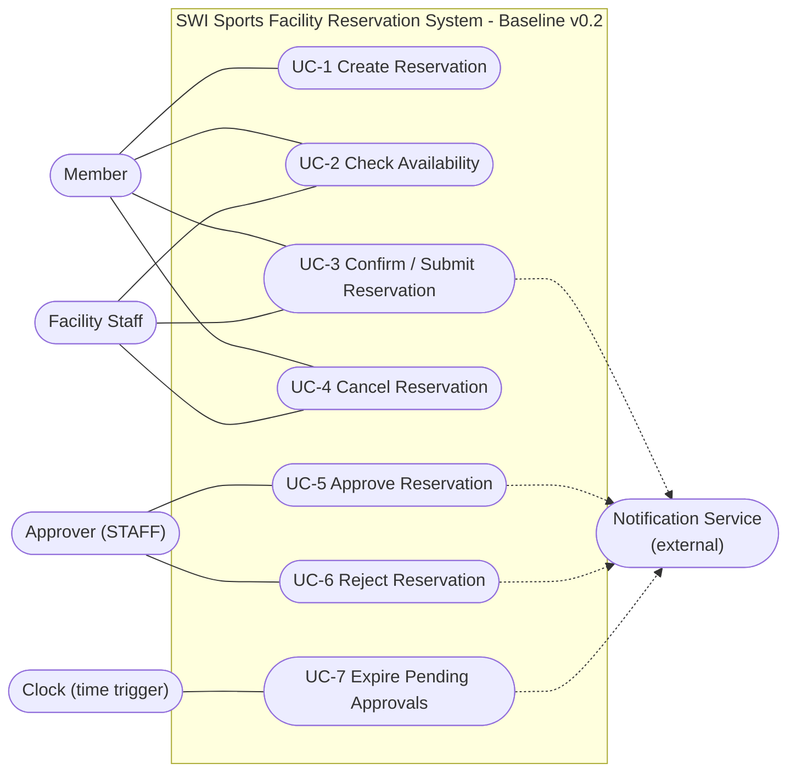
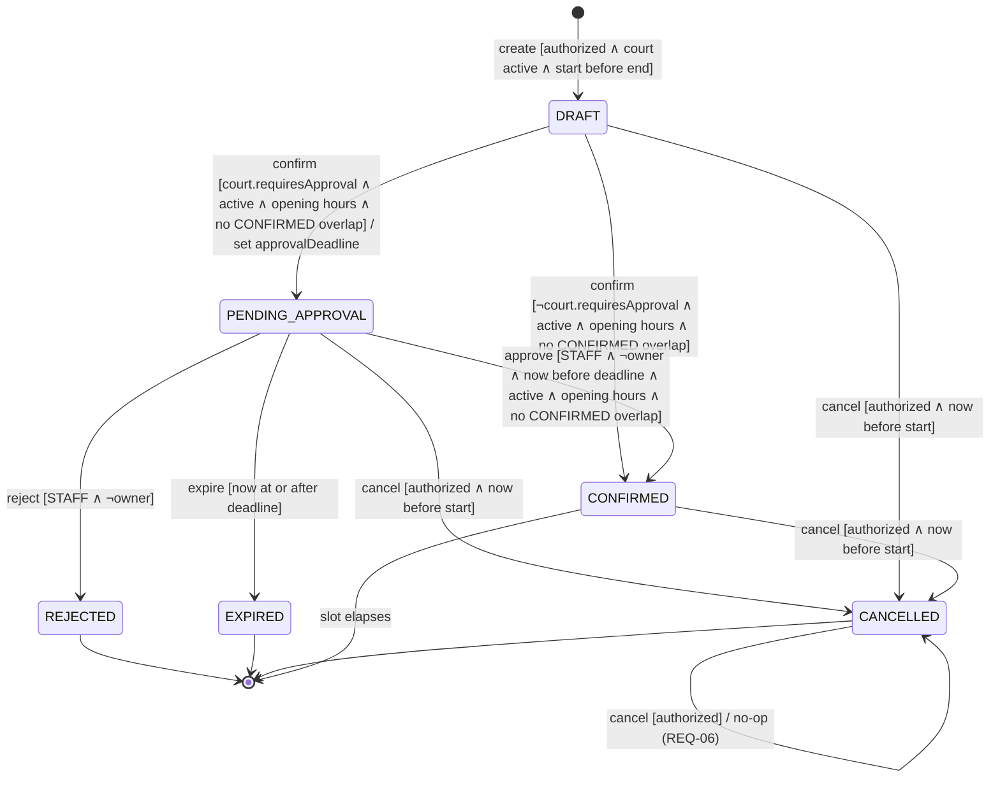
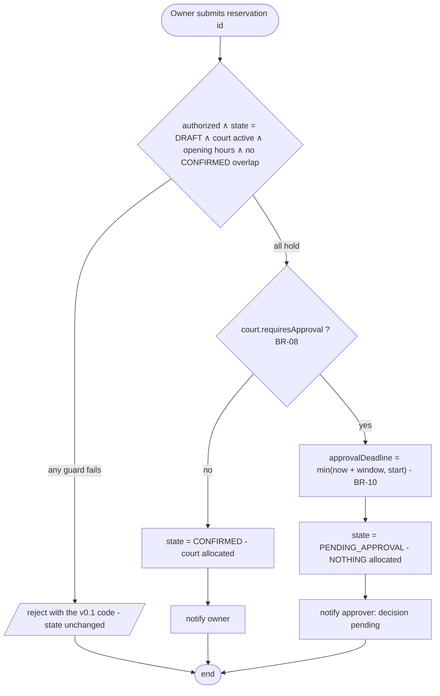
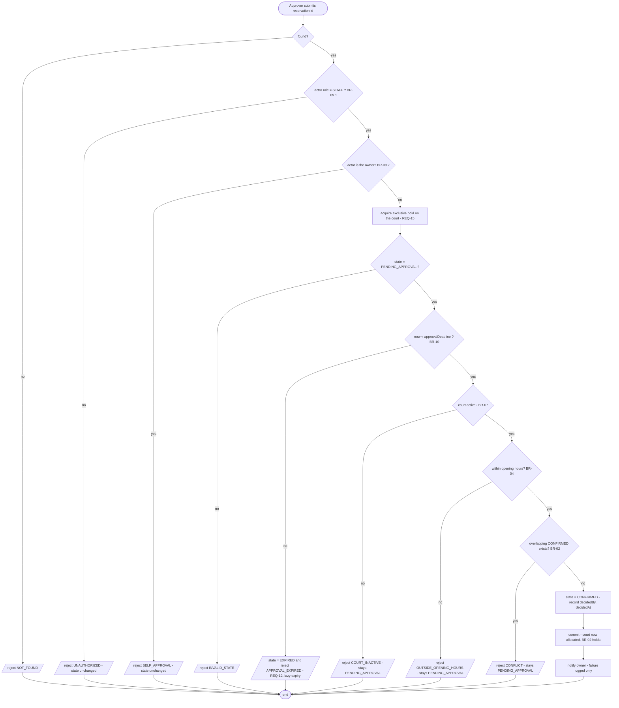
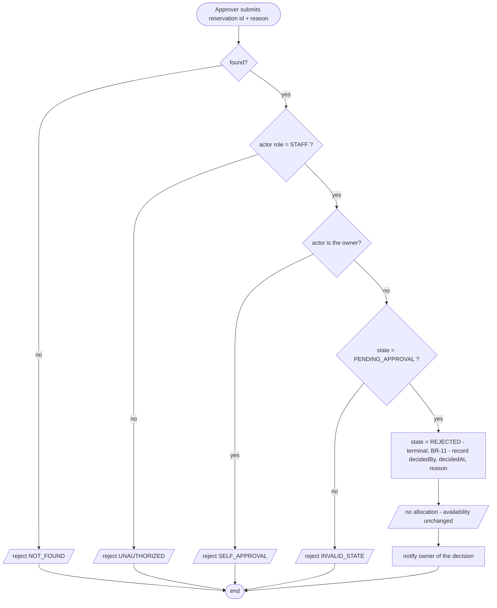
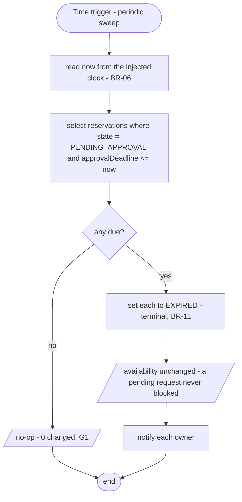

# C02 Change — Approval Workflow → Specification Baseline v0.2

**Status:** ✅ **Specification Baseline v0.2 — Accepted by Team** (see §9).

This document is the **change record**. It does not restate Baseline v0.1
([`c02-baseline-v0.1.md`](c02-baseline-v0.1.md)); it states what the change is,
what it touches, what it provably does **not** touch, and the delta that produces
v0.2. The impact analysis in §2 was completed **before** any specification text or
application code was edited (baseline v0.1 is frozen at git tag `baseline-v0.1`).

---

## 1. Change card

> **C02 Change:** Some Resources require approval by an authorized person before
> the Reservation can become CONFIRMED. Approval may be delayed, rejected, or
> expire.

### 1.1 Reading of the change — what it actually says

| Phrase | What the team reads into it | What it does **not** say |
| --- | --- | --- |
| "**Some** Resources" | The requirement is *per court*, not global. A court is either self-service or approval-gated. | It does not say approval depends on the member, the time of day, or the duration. |
| "require approval **by an authorized person**" | A new human actor with authority, distinct from the member and from generic staff. | It does not say *which* person, nor that a specific individual is assigned per court. |
| "**before** the Reservation can become CONFIRMED" | The gate sits on the transition into CONFIRMED. CONFIRMED keeps exactly its v0.1 meaning: allocated, blocking, invariant-bearing. | It does not say Create changes, and it does not say the reservation is allocated while awaiting approval. |
| "Approval may be **delayed**" | There is an observable waiting state; the reservation is neither confirmed nor dead while it waits. | It does not give a time limit. |
| "**rejected**" | A decision outcome that is distinct from the member withdrawing. | It does not say a rejected request can be resubmitted. |
| "**expire**" | An undecided request eventually stops being approvable **by the passage of time**, with no actor involved. | It does not supply the expiry period — see **A-7**. |

### 1.2 The three decisions the change forces

| # | Question the change forces | Decision | Why |
| --- | --- | --- | --- |
| **D-1** | Is "waiting for approval" a reservation **state**, or a separate approval record hanging off a still-DRAFT reservation? | A first-class state **`PENDING_APPROVAL`**. | "Approval may be delayed" means the wait is observable to the member. A separate record leaves the lifecycle statechart claiming the reservation is still an un-submitted draft, which contradicts the member's actual situation. |
| **D-2** | Does a reservation awaiting approval **block** the court? | **No.** BR-02 is unchanged: only CONFIRMED blocks. Availability instead *discloses* that pending requests exist (REQ-13). | Blocking on a request would let an undecided, possibly-rejected request deny the court to everyone else for the whole approval window — the facility would lose capacity to indecision. The cost of this choice is that two pending requests can contend, resolved at approve time by REQ-10/REQ-15. |
| **D-3** | Do rejection and expiry land in `CANCELLED`, or in their own states? | Distinct terminal states **`REJECTED`** and **`EXPIRED`**. | "The member withdrew", "the manager said no" and "nobody answered in time" are three different facts. Collapsing them destroys the audit trail the approval workflow exists to create, and an approver's performance ("how many requests expired?") becomes unanswerable. |

---

## 2. Impact analysis *(performed before editing)*

### 2.1 Affected requirements / slices

| Element | Impact | What changes |
| --- | --- | --- |
| **OP-03 Confirm** | **Changed postcondition — the biggest impact.** | Its success postcondition is no longer a single outcome. On a self-service court it still yields `CONFIRMED`; on an approval-gated court it yields `PENDING_APPROVAL` and **allocates nothing**. The guard set is unchanged; the *target state* becomes conditional. |
| **REQ-03** | **Amended.** | Was "confirm a DRAFT only when … no overlap". Now: those guards decide whether the request is *admissible*; `court.requiresApproval` decides the resulting state. |
| **OP-04 Cancel / REQ-05 / BR-03.1** | **Amended.** | `PENDING_APPROVAL` is added to the cancellable source states. A member waiting on a slow approver must be able to withdraw. The `now < start` boundary and the idempotency rule are untouched. |
| **OP-02 Availability / REQ-02** | **Extended, not redefined.** | The `available` verdict is computed exactly as in v0.1 (BR-02 still counts only CONFIRMED). Two disclosure fields are added: `approvalRequired` and `pendingApprovalCount`, so a member is told "bookable, but subject to approval, and 2 others are already waiting". |
| **REQ-04 Concurrency** | **Migrated.** | The conflicting-confirm race still exists for self-service courts, and an identical race now appears at **approve** time for gated courts. The requirement generalises to "at most one reservation of a court reaches CONFIRMED over overlapping intervals, whichever operation performs the transition" (REQ-15). |
| **Statechart §8b** | **Changed.** | One new intermediate state, two new terminal states, five new transitions. |
| **Use-case view §8a** | **Changed.** | A new primary actor (**Approver**) and three new goals (UC-5 Approve, UC-6 Reject, UC-7 expiry — the last driven by time, not by a human). |
| **Notification boundary** | **Extended interface, unchanged semantics.** | The approver must learn a request is waiting and the member must learn the decision, so `NotificationService` gains two methods (`notifyApprovalPending`, `notifyDecision`). What does **not** change is the part that matters: it is still one boundary, still the only external dependency, and a failure still must not undo a committed state change (C01 ADR-3). |
| **Architecture drivers** | **Four new ones.** | AD-4, AD-5, AD-6 (from the specification) and AD-8 (discovered while making the baseline run) — see §8. |

### 2.2 Unaffected requirements / slices — **with the reason**

| Element | Unaffected because |
| --- | --- |
| **OP-01 Create / REQ-01** | Create was already specified as a *claim, not an allocation* (finding C-1). The approval gate sits on the transition **into** CONFIRMED, and Create does not touch that transition. A DRAFT on a gated court is byte-for-byte the same object as a DRAFT on a self-service court. **This is the payoff of the v0.1 decision C-1:** had Create allocated the slot, the whole approval workflow would have had to be pushed into OP-01. |
| **BR-01 Interval semantics** | The change says nothing about time intervals. Overlap, half-open bounds and validity are untouched. Every v0.1 interval-boundary example (V-02.1, V-02.3, V-03.3) must still produce the identical answer — re-executed as a regression, §7. |
| **BR-02 Exclusive-resource invariant** | **Deliberately unchanged**, per decision D-2. The blocking set stays exactly `{CONFIRMED}`. This is the single most important "unaffected" claim in the change: the system's core guarantee is not weakened or complicated by the workflow, only reached by a longer path. |
| **BR-04 Opening hours** | Orthogonal to who may approve. Still enforced — but note it is now enforced **at approve time as well**, because time passes while a request waits (see REQ-10). The *rule* is unchanged; its evaluation point is added to. |
| **BR-06 Clock** | Already injected. Expiry needs exactly the clock that already exists — the v0.1 decision AD-2 pays off here: expiry required no time-handling rework. |
| **REQ-06 Cancel idempotency** | A repeated cancel on a `CANCELLED` reservation behaves identically. The new terminal states are **not** given the same idempotent treatment (see §5 OP-04 delta). |
| **REQ-07 / BR-05 Authorization for create/confirm/cancel** | The MEMBER/STAFF rule is unchanged for the three existing operations. Approval authority is an **additional** rule (BR-09), not a redefinition. |
| **The Notification boundary's failure semantics** | Every new notification occasion still takes a reservation and may still fail, and a failure still must not undo a committed state change (C01 ADR-3). The interface grows (see 2.1); the rule about what a failure may and may not do does not. |
| **Persistence approach** | The C01 persistence spike result still holds; new fields and enum values are additive. |

### 2.3 Impact the team explicitly considered and rejected

| Considered | Rejected because |
| --- | --- |
| Making `PENDING_APPROVAL` block the court (a "soft hold") | Decision D-2: an undecided request would deny capacity to everyone for the whole approval window. Recorded as **A-8**: if stakeholders want a hold, it is a *change to BR-02*, and BR-02 is the invariant the system exists to enforce — so it is a major change, not a tweak. |
| Auto-approving when the approver does not respond | Silently granting the facility's capacity on a timeout is the opposite of the change's intent ("require approval"). Expiry therefore *denies*, it does not grant. |
| Letting a REJECTED reservation be resubmitted | Not in the change. The member may create a new reservation; no transition out of REJECTED exists. Recorded as **A-9**. |
| Assigning a named approver per court | The change says "an authorized person", not "the assigned person". Any authorized approver may decide. Recorded as **A-10**. |

---

## 3. New and changed shared rules

### BR-02 — *(unchanged, restated to be unambiguous)*
At no committed state may two CONFIRMED reservations of the same court overlap.
**`PENDING_APPROVAL` does not block.** `DRAFT`, `CANCELLED`, `REJECTED` and
`EXPIRED` do not block.

### BR-03 — Cancellation policy *(amended: clause 1 only)*
1. **Cancellable source states: `DRAFT`, `PENDING_APPROVAL` and `CONFIRMED`.**
   `CANCELLED` is an idempotent no-op (BR-03.3, unchanged). `REJECTED` and
   `EXPIRED` are **not** cancellable — they are already terminal outcomes, and
   reporting "cancelled" for them would overwrite the record of who decided what.
2.–5. Unchanged.

### BR-08 — Approval requirement *(new)*
A court carries `requiresApproval`. When a **DRAFT** reservation for such a court
is confirmed by its owner (OP-03), the reservation enters **`PENDING_APPROVAL`**
and **no allocation is made**. Only an approval decision (OP-05) can move it to
`CONFIRMED`.

`requiresApproval` is read **at confirm time**. Changing the flag afterwards does
not retroactively reclassify reservations already awaiting a decision (**A-11**).

### BR-09 — Approval authority and separation of duty *(new)*
An approval decision (approve or reject) is valid only when the actor:
1. is a known `AppUser` with role **`STAFF`** — the "authorized person" of the
   change card; **and**
2. is **not the owner** of the reservation being decided.

Clause 2 is a deliberate addition: an approval a member can grant themselves is
not an approval. It is the one place where STAFF are *more* restricted than in
BR-05.

### BR-10 — Approval deadline and expiry *(new)*
Every `PENDING_APPROVAL` reservation carries an **`approvalDeadline`**, fixed when
it enters the state:

```
approvalDeadline = min( requestedAt + approvalWindow , reservation.start )
```

- The **invariant part** — `approvalDeadline <= reservation.start` — is justified:
  an approval granted after the slot has begun cannot be honoured.
- `approvalWindow` is a **configuration value, not a business constant**. No
  stakeholder supplied a figure; see **A-7**. The system ships a default of 24 h
  so the behaviour is demonstrable, and the value is externalised precisely so
  that changing it is configuration and not a code change.
- **On or after the deadline** (`now >= approvalDeadline`, strict boundary as in
  BR-03.2) the request is no longer approvable and its outcome is `EXPIRED`.

### BR-11 — Terminality of outcomes *(new)*
`CONFIRMED` is reachable only from `DRAFT` (self-service) or `PENDING_APPROVAL`
(gated). `CANCELLED`, `REJECTED` and `EXPIRED` are **terminal**: no transition
leaves them (except the `CANCELLED` self-loop of REQ-06). The three are kept
distinct because they answer different questions — *the member withdrew*, *the
approver refused*, *nobody decided in time*.

---

## 4. New requirements

| id | Requirement | Rules |
| --- | --- | --- |
| **REQ-09** | Confirming a DRAFT reservation for a court that requires approval shall move it to `PENDING_APPROVAL` with an approval deadline, and shall commit no allocation. | BR-08, BR-10 |
| **REQ-10** | Approving a `PENDING_APPROVAL` reservation shall move it to `CONFIRMED` only when the deadline has not passed, the court is active, the interval lies within opening hours, and no CONFIRMED reservation of that court overlaps — all re-evaluated **at approval time**. | BR-02, BR-04, BR-07, BR-09, BR-10 |
| **REQ-11** | Rejecting a `PENDING_APPROVAL` reservation shall move it to the terminal state `REJECTED`, recording who decided and when, and shall commit no allocation. | BR-09, BR-11 |
| **REQ-12** | A `PENDING_APPROVAL` reservation whose approval deadline has passed shall not be approvable, and its outcome shall be `EXPIRED`. | BR-10, BR-11 |
| **REQ-13** | Check Availability shall compute `available` from CONFIRMED reservations only, and shall additionally disclose whether the court requires approval and how many reservations are awaiting approval for the queried interval. | BR-02, BR-08 |
| **REQ-14** | An approval decision by an actor who is not STAFF, or who owns the reservation being decided, shall be rejected without changing any state. | BR-09 |
| **REQ-15** | For concurrent transitions into CONFIRMED on the same court over overlapping intervals — whether performed by Confirm or by Approve — at most one shall reach CONFIRMED. | BR-02 (generalises REQ-04) |

### Amended requirements

| id | Amendment |
| --- | --- |
| **REQ-03** | The admissibility guards are unchanged; the resulting state is `CONFIRMED` when `¬court.requiresApproval` and `PENDING_APPROVAL` when `court.requiresApproval`. |
| **REQ-05** | `PENDING_APPROVAL` added to the cancellable source states. |
| **REQ-02** | Superseded on the disclosure point by REQ-13; the `available` predicate itself is unchanged. |
| **REQ-04** | Generalised by REQ-15. Retained as the Confirm-time instance. |

---

## 5. Deltas to existing slices

### OP-03 Confirm Reservation — changed
- **Goal / user value** now: *submit* the claim. On a self-service court that is
  instantaneous allocation; on a gated court it is "put it in front of an
  approver".
- **Success postcondition** is now conditional:
  - `¬requiresApproval` → `state = CONFIRMED`, allocation committed, owner notified
    (exactly v0.1);
  - `requiresApproval` → `state = PENDING_APPROVAL`, `approvalDeadline` set per
    BR-10, **no allocation**, an approver notified that a decision is pending.
- **State change:** `DRAFT → CONFIRMED` **or** `DRAFT → PENDING_APPROVAL`.
- **Failure outcomes:** unchanged (C1–C9). The overlap guard C7 still applies to a
  gated court, so an obviously impossible request is refused up front rather than
  wasting an approver's attention.
- **New verification examples:** V-03.10, V-03.11 (§7).

### OP-04 Cancel Reservation — changed
- `PENDING_APPROVAL` added to the cancellable source states (BR-03.1).
- **New failure outcome D7:** cancelling a `REJECTED` or `EXPIRED` reservation is
  rejected `INVALID_STATE`. Deliberately *not* idempotent-success: unlike
  `CANCELLED`, these states were not produced by the member, and reporting
  "cancelled" would misattribute the outcome.
- **New verification examples:** V-04.9, V-04.10.

### OP-02 Check Availability — extended
- Result gains `approvalRequired` and `pendingApprovalCount` (REQ-13).
- `available` is unchanged. **V-02.11** pins this: a slot with two pending
  requests and no CONFIRMED reservation is still `AVAILABLE`.

---

## 6. New slices

## OP-05 — Approve Reservation

**Goal / user value:** an authorized person grants the facility's capacity for a
controlled court, so that scarce or supervised resources are allocated by a human
decision rather than first-come-first-served.

**Trigger:** an approver submits an approval decision for a reservation by id.

**Observable requirement(s):** REQ-10, REQ-14, REQ-15.

**Preconditions:**
- reservation exists and `state = PENDING_APPROVAL`;
- actor is STAFF and is not the reservation's owner (BR-09);
- `now < reservation.approvalDeadline` (BR-10);
- court is `active` (BR-07);
- interval within opening hours (BR-04);
- no overlapping CONFIRMED reservation for that court (BR-02).

> **Why every OP-03 guard is re-evaluated here:** time passes while a request
> waits. Between confirm and approval the court may have been deactivated, its
> opening hours may have changed, and — crucially — another reservation may have
> become CONFIRMED over the same slot. The approval decision, not the original
> submission, is the moment the allocation is committed, so it is the moment the
> guards must hold.

**Success postcondition:**
- `state = CONFIRMED`;
- the reservation **blocks** the court (BR-02);
- the decision is recorded: `decidedBy`, `decidedAt`;
- BR-02 holds over the committed state, including under concurrency (REQ-15);
- the owner is notified; notification failure does not undo the approval.

**State change:** `PENDING_APPROVAL → CONFIRMED`.

**Referenced business rule(s) / invariant(s):** BR-01, BR-02, BR-04, BR-07, BR-09,
BR-10, BR-11.

### Main success scenario
1. Approver submits the reservation id.
2. System validates the actor is STAFF and not the owner (BR-09).
3. System establishes an exclusive hold on the court (REQ-15).
4. System checks `state = PENDING_APPROVAL`.
5. System reads `now` (BR-06) and checks `now < approvalDeadline` (BR-10).
6. System checks the court is active (BR-07).
7. System checks the interval against opening hours (BR-04).
8. System checks no CONFIRMED reservation of that court overlaps (BR-02).
9. System sets `state = CONFIRMED`, records `decidedBy` / `decidedAt`, commits.
10. System notifies the owner; failure is logged, not propagated.

### Alternative / failure outcomes
| # | Condition | Outcome |
| --- | --- | --- |
| E1 | reservation not found | reject `NOT_FOUND` |
| E2 | actor is not STAFF | reject `UNAUTHORIZED`; state unchanged (REQ-14) |
| E3 | actor is STAFF **and** owns the reservation | reject `SELF_APPROVAL`; state unchanged (BR-09.2) |
| E4 | `state = DRAFT` (never submitted) | reject `INVALID_STATE` |
| E5 | `state = CONFIRMED` (already approved) | reject `INVALID_STATE` — not idempotent, for the same reason as OP-03 C2 |
| E6 | `state ∈ {CANCELLED, REJECTED, EXPIRED}` | reject `INVALID_STATE`; state unchanged |
| E7 | `now >= approvalDeadline` | reject `APPROVAL_EXPIRED`, **and** the reservation is moved to `EXPIRED` (REQ-12) — see note below |
| E8 | court deactivated since submission | reject `COURT_INACTIVE`; **stays PENDING_APPROVAL** so the request survives a temporary closure |
| E9 | opening hours changed so the slot no longer fits | reject `OUTSIDE_OPENING_HOURS`; stays PENDING_APPROVAL |
| E10 | another reservation became CONFIRMED over the slot while waiting | reject `CONFLICT`; **stays PENDING_APPROVAL** — the approver may still reject it explicitly, and the member may cancel it |
| E11 | two approvers approve conflicting pending reservations in parallel | exactly one reaches CONFIRMED; the other is rejected `CONFLICT` (REQ-15) |

> **E7 is a state change inside a failure.** This is deliberate: expiry is caused
> by the passage of time, not by the approver, so the attempt merely *discovers*
> an outcome that was already due. Handling it lazily means correctness does not
> depend on a background sweep having run (OP-07 exists for reporting and
> notification, not for correctness).

> **E8/E9/E10 deliberately do not change state.** A failed approval attempt is
> not a decision. Only an approver's explicit rejection, a member's cancellation,
> or the deadline may end the wait.

### Verification examples
| id | Given | When | Then |
| --- | --- | --- | --- |
| V-05.1 | PENDING_APPROVAL on a gated court, staff approver ≠ owner, before deadline | approve | `CONFIRMED`; slot becomes UNAVAILABLE / CONFLICT |
| V-05.2 | as V-05.1 but actor is a MEMBER | approve | rejected `UNAUTHORIZED`; **stays PENDING_APPROVAL** |
| V-05.3 | as V-05.1 but the approver **is** the owner (a STAFF member's own booking) | approve | rejected `SELF_APPROVAL`; stays PENDING_APPROVAL (BR-09.2) |
| V-05.4 | **BOUNDARY** `now == approvalDeadline` | approve | rejected `APPROVAL_EXPIRED`, and state becomes `EXPIRED` (REQ-12) |
| V-05.5 | a conflicting reservation became CONFIRMED while waiting | approve | rejected `CONFLICT`; **stays PENDING_APPROVAL** |
| V-05.6 | court deactivated while waiting | approve | rejected `COURT_INACTIVE`; stays PENDING_APPROVAL |
| V-05.7 | a DRAFT (never submitted) | approve | rejected `INVALID_STATE` |
| V-05.8 | an already CONFIRMED reservation | approve | rejected `INVALID_STATE` |
| V-05.9 | **two** PENDING_APPROVAL reservations for the same slot, approved from 2 threads at once | approve ×2 | exactly **1** CONFIRMED, the other rejected `CONFLICT` and still PENDING_APPROVAL (REQ-15) |

**Rationale / source:** C02 change card §B.12, "Some Resources require approval by
an authorized person before the Reservation can become CONFIRMED".

**Assumption / unknown / TBD:** A-7 (approval window value), A-10 (any authorized
approver may decide, no per-court assignment).

---

## OP-06 — Reject Reservation

**Goal / user value:** an authorized person refuses a request explicitly, so the
member gets a definite answer instead of waiting out the deadline, and the
facility has a record of the refusal.

**Trigger:** an approver submits a rejection for a reservation by id, optionally
with a reason.

**Observable requirement(s):** REQ-11, REQ-14.

**Preconditions:**
- reservation exists and `state = PENDING_APPROVAL`;
- actor is STAFF and is not the owner (BR-09).

> Note the asymmetry with OP-05: rejection does **not** require the court to be
> active, the interval to fit opening hours, or the slot to be free. Those guards
> exist to protect the allocation, and a rejection allocates nothing. Refusing a
> request on a court that has meanwhile closed must remain possible.

**Success postcondition:**
- `state = REJECTED` (terminal, BR-11);
- `decidedBy`, `decidedAt` and the optional reason are recorded;
- **no allocation** — availability is unchanged by a rejection;
- the owner is notified of the decision.

**State change:** `PENDING_APPROVAL → REJECTED`.

**Referenced business rule(s) / invariant(s):** BR-09, BR-11.

### Main success scenario
1. Approver submits the reservation id and an optional reason.
2. System validates the actor is STAFF and not the owner (BR-09).
3. System checks `state = PENDING_APPROVAL`.
4. System sets `state = REJECTED`, records the decision, commits.
5. System notifies the owner.

### Alternative / failure outcomes
| # | Condition | Outcome |
| --- | --- | --- |
| F1 | reservation not found | reject `NOT_FOUND` |
| F2 | actor is not STAFF | reject `UNAUTHORIZED`; state unchanged |
| F3 | actor owns the reservation | reject `SELF_APPROVAL`; state unchanged |
| F4 | `state ≠ PENDING_APPROVAL` | reject `INVALID_STATE`; state unchanged |
| F5 | `now >= approvalDeadline` | **rejection still succeeds** → `REJECTED`. The deadline limits *approval* (BR-10), not the recording of a refusal; and the outcome is terminal either way. |

### Verification examples
| id | Given | When | Then |
| --- | --- | --- | --- |
| V-06.1 | PENDING_APPROVAL, staff approver ≠ owner | reject with reason | `REJECTED`; `decidedBy` recorded; availability of the slot unchanged (still AVAILABLE) |
| V-06.2 | a REJECTED reservation | approve it | rejected `INVALID_STATE`; stays REJECTED (terminality, BR-11) |
| V-06.3 | as V-06.1 but the actor is a MEMBER | reject | rejected `UNAUTHORIZED`; stays PENDING_APPROVAL |
| V-06.4 | a CONFIRMED reservation | reject | rejected `INVALID_STATE` — an allocation is undone by Cancel, not by a late refusal |

**Rationale / source:** change card, "Approval may be … rejected".

---

## OP-07 — Expire Pending Approvals

**Goal / user value:** the facility's pending queue tells the truth — a request
nobody decided in time is visibly closed rather than sitting as "waiting"
forever, and the member is told.

**Trigger:** **time**, not an actor. A periodic sweep of the system.

**Observable requirement(s):** REQ-12.

**Preconditions:** none beyond the clock (BR-06). This slice has **no human
actor** — it is the one goal in the use-case view driven by an external
time-based trigger.

**Success postcondition:**
- every reservation with `state = PENDING_APPROVAL` and
  `now >= approvalDeadline` has `state = EXPIRED`;
- **no allocation** is created or removed — expiry cannot change availability,
  because a pending reservation never blocked (BR-02, decision D-2);
- owners are notified.

**State change:** `PENDING_APPROVAL → EXPIRED` for each due reservation.

**Referenced business rule(s) / invariant(s):** BR-10, BR-11.

### Main success scenario
1. The sweep runs and reads `now` (BR-06).
2. It selects every `PENDING_APPROVAL` reservation with
   `approvalDeadline <= now`.
3. It sets each to `EXPIRED` and commits.
4. It notifies each owner.

### Alternative / failure outcomes
| # | Condition | Outcome |
| --- | --- | --- |
| G1 | nothing is due | no-op; zero reservations changed. The sweep is idempotent and safe to run at any frequency. |
| G2 | the sweep has not run although a deadline has passed | **correctness is not affected**: OP-05 E7 expires the request lazily on the next approval attempt. The sweep affects *timeliness of reporting*, never whether an expired request can be approved. |
| G3 | a request is cancelled by the member before the sweep sees it | it is no longer `PENDING_APPROVAL` and is skipped. Cancel wins — the member acted, time merely elapsed. |

### Verification examples
| id | Given | When | Then |
| --- | --- | --- | --- |
| V-07.1 | PENDING_APPROVAL with deadline 10:00, now = 10:30 | run the sweep | `EXPIRED`; the slot's availability is unchanged (it never blocked) |
| V-07.2 | **BOUNDARY** deadline 10:00, now = 09:59 | run the sweep | **stays PENDING_APPROVAL** — the deadline has not passed |
| V-07.3 | **BOUNDARY** deadline 10:00, now = 10:00 exactly | run the sweep | `EXPIRED` (`now >= deadline`, BR-10) |
| V-07.4 | no due requests | run the sweep | 0 changed (G1) |

**Rationale / source:** change card, "Approval may … expire".

**Assumption / unknown / TBD:** A-7 (the window), and **A-12**: the sweep's
*frequency* is an operational choice, not a business requirement — G2 is what
makes that acceptable.

---

## 7. Updated views and verification

### 7a. Use-case / actor-goal view — v0.2

```
                        SWI Sports Facility Reservation System
              ┌──────────────────────────────────────────────────────┐
              │                                                      │
              │        ( UC-1  Create Reservation )                  │
  ┌────────┐  │                                                      │
  │ Member ├──┼────────( UC-2  Check Availability )                  │
  └────────┘  │                                                      │
              │        ( UC-3  Confirm / Submit Reservation ) ┄┄┄┄┄┄┄┼┄┄┐
  ┌──────────┐│                                                      │  │
  │ Facility ├┼────────( UC-4  Cancel Reservation )                  │  │  ┌──────────────┐
  │  Staff   ││                                                      │  ├─>│ Notification │
  └──────────┘│        ( UC-5  Approve Reservation ) ┄┄┄┄┄┄┄┄┄┄┄┄┄┄┄┄┼┄┄┤  │   Service    │
  ┌──────────┐│                                                      │  │  │  (external)  │
  │ Approver ├┼────────( UC-6  Reject Reservation ) ┄┄┄┄┄┄┄┄┄┄┄┄┄┄┄┄┄┼┄┄┤  └──────────────┘
  │ (STAFF)  ││                                                      │  │
  └──────────┘│        ( UC-7  Expire Pending Approvals ) ┄┄┄┄┄┄┄┄┄┄┄┼┄┄┘
              │                    ▲                                 │
              └────────────────────┼─────────────────────────────────┘
                                   │ time-based trigger
                            ┌──────┴──────┐
                            │    Clock    │  (supporting, non-human)
                            └─────────────┘
```

| Actor | Kind | Change | Goals |
| --- | --- | --- | --- |
| **Member** | primary, human | unchanged | UC-1, UC-2, UC-3, UC-4 (own) |
| **Facility Staff** | primary, human | unchanged | UC-2, UC-3, UC-4 (any) |
| **Approver** | **primary, human — NEW** | the "authorized person" of the change card; a STAFF user acting on someone else's reservation (BR-09) | UC-5 Approve, UC-6 Reject |
| **Clock** | **supporting, non-human — NEW** | the only *time-triggered* goal in the system | UC-7 Expire |
| **Notification Service** | supporting, external | more calls, same contract | receives messages from UC-3, UC-5, UC-6, UC-7 |



### 7b. Reservation lifecycle statechart — v0.2



**New / changed edges — traceability:**

| Edge | Guard | Slice | Rules | New? |
| --- | --- | --- | --- | --- |
| `DRAFT → PENDING_APPROVAL` | gated court ∧ v0.1 confirm guards | OP-03 | BR-08, BR-10 | **new** |
| `DRAFT → CONFIRMED` | **¬gated** ∧ v0.1 confirm guards | OP-03 | unchanged + BR-08 | guard tightened |
| `PENDING_APPROVAL → CONFIRMED` | BR-09 ∧ BR-10 ∧ BR-07 ∧ BR-04 ∧ BR-02 | OP-05 | BR-02,04,07,09,10 | **new** |
| `PENDING_APPROVAL → REJECTED` | STAFF ∧ ¬owner | OP-06 | BR-09, BR-11 | **new** |
| `PENDING_APPROVAL → EXPIRED` | `now >= deadline` | OP-05 E7, OP-07 | BR-10, BR-11 | **new** |
| `PENDING_APPROVAL → CANCELLED` | authorized ∧ `now < start` | OP-04 | BR-03.1 | **new** |

**Absent edges are still claims.** There is no `REJECTED → *`, no `EXPIRED → *`,
no `PENDING_APPROVAL → DRAFT`, and still no `CANCELLED → CONFIRMED`. These
correspond to BR-11 and to outcomes E6, F4, V-06.2.

### 7c. Activity flows for the new features

**OP-03 Confirm — updated (the branch is the change)**


**OP-05 Approve Reservation**


**OP-06 Reject Reservation**


**OP-07 Expire Pending Approvals**


### 7d. New verification examples on existing slices

| id | Slice | Given | When | Then |
| --- | --- | --- | --- | --- |
| **V-02.11** | OP-02 | gated court, 2 PENDING_APPROVAL reservations for `[10:00,11:00)`, no CONFIRMED | check availability `[10:00,11:00)` | **AVAILABLE**, `approvalRequired = true`, `pendingApprovalCount = 2` (REQ-13, decision D-2) |
| **V-03.10** | OP-03 | DRAFT on a court with `requiresApproval = true` | confirm | `PENDING_APPROVAL` with a deadline set; availability **unchanged** (still AVAILABLE) |
| **V-03.11** | OP-03 | DRAFT on a court with `requiresApproval = false` | confirm | `CONFIRMED` — v0.1 behaviour preserved (regression) |
| **V-03.12** | OP-03 | gated court, `[10:00,11:00)` already CONFIRMED, new DRAFT `[10:30,11:30)` | confirm | rejected `CONFLICT`, stays DRAFT — an impossible request never reaches an approver |
| **V-04.9** | OP-04 | PENDING_APPROVAL, now < start | cancel by owner | `CANCELLED` (BR-03.1 amended) |
| **V-04.10** | OP-04 | REJECTED reservation | cancel | rejected `INVALID_STATE`, stays REJECTED (D7) |

### 7e. Cross-view consistency review of v0.2

| id | Check | Result |
| --- | --- | --- |
| **C-13** | Does every new statechart edge have a slice and a rule? | **Yes** — see the traceability table in §7b; six edges, all mapped. |
| **C-14** | Do the blocking states in BR-02, OP-02 and OP-05 still agree? | **Yes** — all three still say exactly `{CONFIRMED}`. `PENDING_APPROVAL` was added to the *lifecycle*, deliberately not to the *blocking set*. The implementation keeps the set in one place (`ReservationState.blocksCourt`), so the three cannot drift. |
| **C-15** | Availability vs Approve: can availability say AVAILABLE and approval then fail? | **Yes, and that is specified, not accidental** — two pending requests for one slot both see AVAILABLE, and only one can be approved (V-05.9). Disclosure of `pendingApprovalCount` is what makes this honest rather than misleading. Extends A-2. |
| **C-16** | Does the new actor have goals, and do all goals have actors? | **Yes** — Approver ↔ UC-5/UC-6. UC-7 has a *non-human* trigger, explicitly modelled as the Clock actor rather than quietly left actorless. |
| **C-17** | Terminal-state consistency | `REJECTED` / `EXPIRED` have no outgoing edges in §7b; OP-04 D7 and OP-05 E6 reject every attempt; V-06.2 and V-04.10 execute it. |
| **C-18** | Expiry boundary consistency | BR-10 says `now >= deadline` expires. V-07.2 (09:59 → pending), V-07.3 (10:00 → expired) and V-05.4 (`now == deadline` → APPROVAL_EXPIRED) all agree. Note this boundary is the **mirror image** of BR-03.2 (`now < start` to cancel) — both were written explicitly to avoid an off-by-one reading. |
| **C-19** | Design leakage in the new requirements | REQ-10 and REQ-15 state outcomes. "Exclusive hold" in the OP-05 scenario is the property; the mechanism is AD-1/AD-4 for C03. `approvalWindow` is named as configuration, not embedded as a business constant. |
| **C-20** | Fabricated precision | The only number the change needs is the approval window; it is **not** invented as a business rule but declared configuration with **A-7** recorded. The part that *is* asserted (`deadline <= start`) carries its justification. |
| **C-21** | Does the change weaken any v0.1 guarantee? | **No.** BR-02 is textually unchanged, and every v0.1 verification example is re-executed as a regression (§8 evidence). The one v0.1 behaviour that *changes* is OP-03's target state on gated courts, which is the change itself. |

---

## 8. Architecture drivers carried into C03

Existing: **AD-1** (BR-02 under concurrency), **AD-2** (injectable time — already
paid off, expiry needed no rework), **AD-3** (real authentication).

AD-4…AD-7 came out of the specification work; **AD-8 came out of executing it** —
it was found because a verification example failed, not because anyone predicted
it. That is the point of building the running baseline.

| id | Driver | Discovered from | Why it is architectural, not a coding task |
| --- | --- | --- | --- |
| **AD-4** | **The lifecycle is now a real state machine and needs an explicit home.** 6 states, 10 transitions, each with a multi-clause guard; four operations now branch on state. | v0.2 statechart §7b vs v0.1 §8b | In C02 the transition rules live in `if` cascades inside one service class, and the same guard set is duplicated between Confirm and Approve. The next change (a second approval level, a resubmission edge) multiplies that duplication. C03 must decide where transitions and guards live — entity methods, an explicit state machine, or a policy object — and how the statechart stays provably in sync with the code. |
| **AD-5** | **A time-triggered process has entered a request-driven system.** OP-07 has no human actor and no HTTP request. | OP-07, BR-10, G2 | The v0.1 architecture has exactly one entry style: an inbound call. A sweep introduces a scheduler, "who runs it and how often", idempotency, and behaviour across multiple instances (two nodes must not both expire and both notify). This is a structural boundary, not a method. The lazy-expiry fallback (E7) is the mitigation that keeps *correctness* independent of it — an explicit architectural choice worth recording. |
| **AD-6** | **The allocation guarantee's enforcement point has moved and multiplied.** In v0.1 exactly one operation transitioned into CONFIRMED; in v0.2 two do, and REQ-15 must hold across both. | REQ-15, V-05.9, C-14 | A per-operation guard cannot be the guarantee once N operations can allocate; the invariant needs a single enforcement point (a DB constraint, or one funnel every allocation passes through). This sharpens AD-1 from "make confirm safe" to "make the invariant enforceable independently of which operation runs". |
| **AD-8** | **A failure outcome that must persist state has no home in the current layering.** OP-05 E7 rejects the approval *and* must leave the request EXPIRED; throwing rolls the transaction back and discards the write. | Mismatch **M-2** (see the evidence file), OP-05 E7, REQ-12 | C02 solved it with a collaborator that commits in its own transaction (`LazyApprovalExpiry`). That works, but it means "which failures commit and which roll back" is now an implicit, per-method convention. C03 must make the transaction boundary an explicit design decision - otherwise the next state-changing failure either repeats the collaborator or silently loses its write. |
| **AD-7** | **The availability read model is diverging from the write model.** REQ-13's answer now combines the blocking set with a count of pending requests and a court property. | REQ-13, V-02.11, C-15 | Availability is the highest-traffic operation and no longer a simple projection of one predicate. C03 should decide whether reads keep sharing the write model or get their own — with the honest caveat that a separate read model makes staleness (A-2) worse, not better. |

---

## 9. Acceptance

All nine consistency checks C-13…C-21 are closed. The four new/amended
requirements plus REQ-09…REQ-15 were each taken through the nine-line acceptance
gate of v0.1 §7 (recorded in §10 below). New uncertainty is stated, not invented.

> ### ✅ Specification Baseline v0.2 — Accepted by Team
> **Team:** Holy Trio — Pavel Valošek, Rostislav Nevoral, Pavel Mynář
> **Accepted:** v0.1 as amended in §3/§5, plus BR-08…BR-11, REQ-09…REQ-15,
> OP-05/OP-06/OP-07, the §7a use-case view, the §7b statechart and the §7c
> activity flows.
> **Out of scope:** multi-level approval, per-court approver assignment,
> resubmission of a rejected request, payment, quotas, authentication.

---

## 10. Acceptance gate for the new requirements

### REQ-09 — Confirm on a gated court → PENDING_APPROVAL
| Question | Answer |
| --- | --- |
| Meaning | "Requires approval" is the per-court flag of BR-08, read at confirm time. The resulting state allocates nothing. |
| Need / rationale | The change card: approval must happen *before* CONFIRMED. A waiting state is what makes "delayed" observable. |
| Observable | Yes — `state = PENDING_APPROVAL`, a deadline is set, and availability for the slot is **unchanged**. |
| Feasible | Yes — it strictly weakens what Confirm claims on gated courts, so it cannot violate BR-02. |
| Verifiable | V-03.10 (gated), V-03.11 (non-gated regression), V-03.12 (conflict still refused up front). |
| State / time | Sets a time-dependent field (`approvalDeadline`, BR-10) whose value depends on `now` at submission. |
| Concurrency | Two parallel submissions for one slot both succeed — by design (D-2). The contention is resolved at approve time (REQ-15), not here. |
| Consistency | The target state matches the new statechart edge; the guard set is identical to v0.1's, so C-3's availability/confirm agreement survives. |
| Unknown? | A-7 (window value), A-11 (flag changes are not retroactive). |

### REQ-10 — Approve → CONFIRMED
| Question | Answer |
| --- | --- |
| Meaning | Every guard is a referenced rule, **re-evaluated at approval time** — the key word, since the state of the world changed while waiting. |
| Need / rationale | This is the moment the facility's capacity is actually committed for a gated court. |
| Observable | Yes — `CONFIRMED`, the slot flips to UNAVAILABLE, and `decidedBy`/`decidedAt` are recorded. On failure the state is explicitly specified (unchanged for E8–E10, `EXPIRED` for E7). |
| Feasible | Yes, together with REQ-15. |
| Verifiable | V-05.1 (success), V-05.4 (deadline boundary), V-05.5, V-05.6, V-05.7, V-05.8 (negatives). |
| State / time | Both, heavily: source state, deadline, and other reservations' states — all re-read now, not remembered from submission. |
| Concurrency | Decisive — split out as REQ-15 rather than left implicit, exactly as v0.1 split REQ-04 out of REQ-03. |
| Consistency | Uses the same blocking set as BR-02/OP-02 (C-14); the guard list duplicates OP-03's, which is precisely the duplication recorded as driver **AD-4**. |
| Unknown? | A-10 (any authorized approver, not an assigned one). |

### REQ-11 — Reject → REJECTED
| Question | Answer |
| --- | --- |
| Meaning | Terminal refusal by an authorized person, with the decision recorded. |
| Need / rationale | Without it the only way to say "no" is to let the deadline lapse, which is slower for the member and indistinguishable from neglect. |
| Observable | Yes — `REJECTED`, `decidedBy`/`decidedAt` set, availability unchanged. |
| Feasible | Yes — it allocates nothing, so it needs none of OP-05's allocation guards (the asymmetry is stated in the slice). |
| Verifiable | V-06.1, V-06.3, V-06.4, and V-06.2 for terminality. |
| State / time | Source state only. Deliberately **not** deadline-bound (F5) — a refusal remains recordable after the deadline. |
| Concurrency | Reject vs Approve on one reservation: both serialise on the court hold; the loser fails on the source-state guard. |
| Consistency | Distinct from CANCELLED per BR-11 and D-3; the statechart has no edge out of REJECTED. |
| Unknown? | A-9 (no resubmission specified). |

### REQ-12 — Expiry
| Question | Answer |
| --- | --- |
| Meaning | `now >= approvalDeadline` makes the request un-approvable; the outcome is `EXPIRED`. Enforced **twice**: lazily at approval (E7) and by the sweep (OP-07). |
| Need / rationale | The change card says approval may expire; and an approval after the slot starts cannot be honoured (BR-10's invariant part). |
| Observable | Yes — `state = EXPIRED`, and an approval attempt is refused `APPROVAL_EXPIRED`. |
| Feasible | Yes. The double enforcement is consistent: both use the same predicate on the same clock. |
| Verifiable | V-05.4 (`now == deadline`), V-07.1, V-07.2 (09:59), V-07.3 (10:00). |
| State / time | Purely time-driven — the only rule in the system whose trigger is the clock alone. |
| Concurrency | Sweep vs cancel (G3) and sweep vs approve (E7) both resolve on the source-state guard; expiry never removes an allocation, so no invariant is at risk. |
| Consistency | Boundary is the mirror of BR-03.2 and is checked as C-18. Correctness does not depend on the sweep (G2). |
| Unknown? | **A-7** (the window value) and **A-12** (sweep frequency) — both explicit. |

### REQ-13 — Availability discloses approval and contention
| Question | Answer |
| --- | --- |
| Meaning | `available` is computed from CONFIRMED only; `approvalRequired` and `pendingApprovalCount` are additional, non-binding disclosure. |
| Need / rationale | Under D-2 a member could otherwise be told "available", submit, and lose to a pending request they could not see. |
| Observable | Yes — three fields, and the count is specific to the queried interval. |
| Feasible | Yes; it reads more data but changes no predicate. |
| Verifiable | V-02.11. |
| State / time | A snapshot, exactly as in v0.1 (A-2). |
| Concurrency | The count is inherently racy; it is disclosure, not a guarantee. Stated rather than implied. |
| Consistency | `available` is unchanged (C-14), so no v0.1 availability example changes answer — re-executed as regression. |
| Unknown? | A-2 extended by C-15. |

### REQ-14 — Approver authorization and separation of duty
| Question | Answer |
| --- | --- |
| Meaning | STAFF role **and** not the owner (BR-09). Both clauses, both observable. |
| Need / rationale | An approval a member can grant themselves is not an approval — it would make the gate decorative for any staff member booking a controlled court. |
| Observable | Yes — `UNAUTHORIZED` vs `SELF_APPROVAL` are distinct codes, and the state is asserted unchanged. |
| Feasible | Yes, under A-1. Note it makes STAFF *more* restricted here than under BR-05 — intentional and called out. |
| Verifiable | V-05.2 (not staff), V-05.3 (staff but owner), V-06.3. |
| State / time | Role and ownership read at decision time. |
| Concurrency | None. |
| Consistency | Additive to BR-05, does not contradict it; BR-05 governs create/confirm/cancel, BR-09 governs decisions. |
| Unknown? | A-1 (identity asserted, not authenticated) — driver AD-3. A-10 (no per-court assignment). |

### REQ-15 — Concurrency across both allocating operations
| Question | Answer |
| --- | --- |
| Meaning | Generalises REQ-04: whichever operation performs the transition into CONFIRMED, at most one wins per court per overlapping interval. |
| Need / rationale | v0.2 has two allocating operations; a guarantee attached to one of them is not a guarantee. |
| Observable | Yes — after N parallel approvals of conflicting pending reservations, count(CONFIRMED) ≤ 1 and the losers are still PENDING_APPROVAL. |
| Feasible | Yes; outcome-only, mechanism unspecified. |
| Verifiable | V-05.9 (2 threads, approve) plus V-03.9 retained (8 threads, confirm). |
| State / time | About interleaving, as REQ-04 was. |
| Concurrency | This *is* the requirement. |
| Consistency | Subsumes REQ-04 without contradicting it; BR-02 unchanged. |
| Unknown? | Mechanism deliberately open — drivers **AD-1 / AD-6**. |

---

## 11. Assumptions and unknowns added by v0.2

| id | Kind | Statement | Impact if wrong |
| --- | --- | --- | --- |
| **A-7** | **Unknown** | The approval window has **no stakeholder-supplied value**. The system treats it as configuration (default 24 h) rather than asserting a business rule. | Only the configured value changes. The *invariant* `deadline <= start` is independent of it, which is why the unknown is cheap. |
| **A-8** | Assumption | Members accept that a pending request does not hold the slot (decision D-2). | A "soft hold" would be a change to **BR-02** — the core invariant — and therefore a major change, not a tweak. |
| **A-9** | Unknown | Whether a REJECTED request may be resubmitted or appealed. | Would add a transition out of a state currently specified as terminal, and a new operation. |
| **A-10** | Assumption | Any STAFF user (other than the owner) may decide any pending request; there is no per-court approver assignment. | Would add an assignment concept and an authorization clause to BR-09. |
| **A-11** | Assumption | Toggling `court.requiresApproval` does not reclassify reservations already submitted. | Would require a migration sweep over pending/confirmed reservations. |
| **A-12** | Assumption | The expiry sweep's frequency is operational, not contractual; correctness is preserved by lazy expiry (G2). | If a stakeholder requires "notified within X minutes of expiry", the sweep gains a real timing requirement — driver **AD-5**. |

Carried forward unchanged from v0.1: **A-1** … **A-6**.

---

*Evidence that the running application matches this baseline:
[`c02-evidence.md`](c02-evidence.md).*
