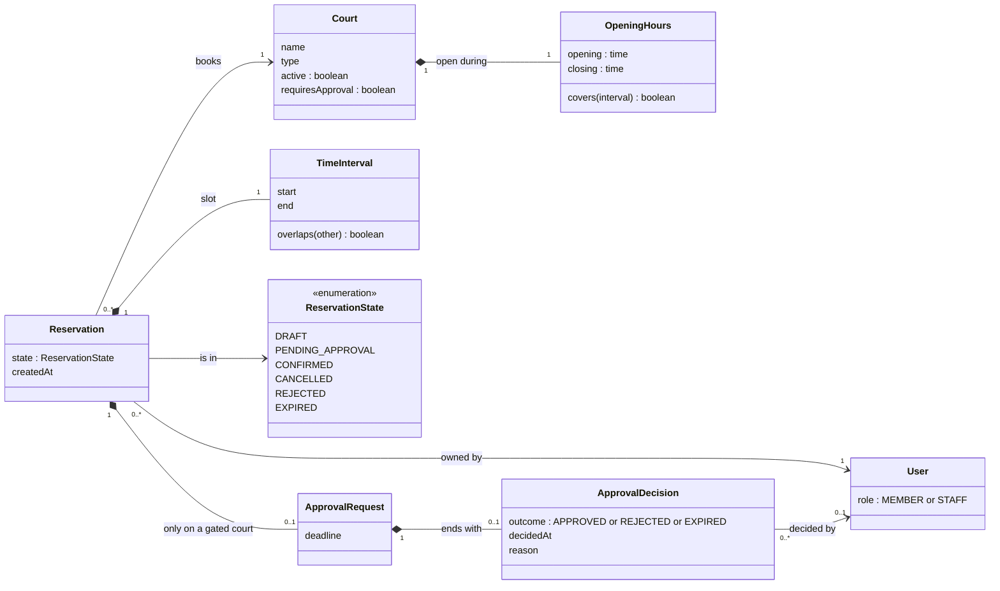
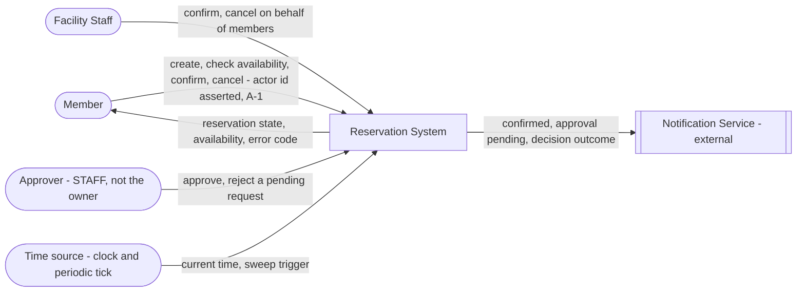
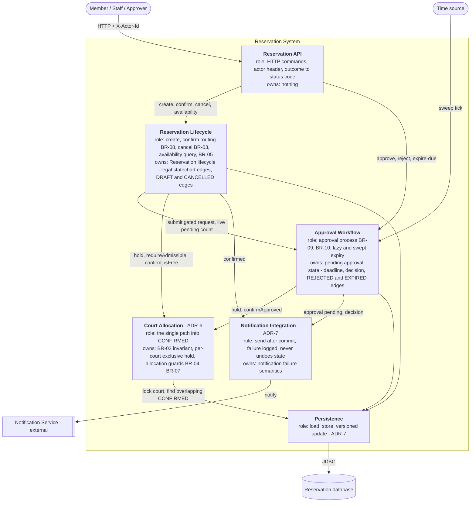
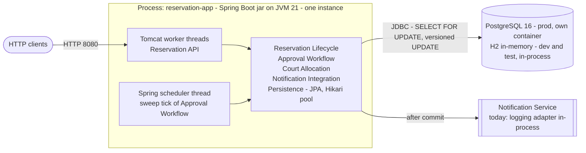
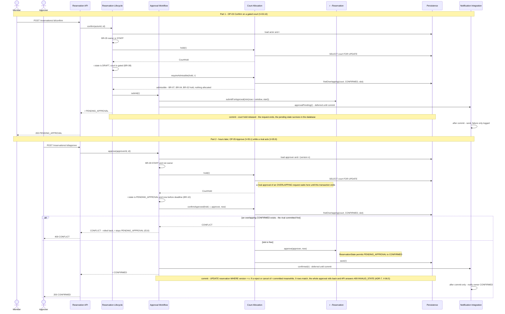
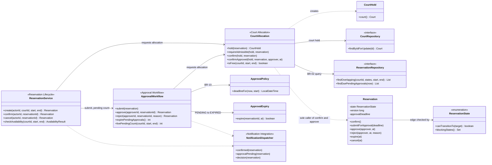

# C03 — Architecture: from the AS-IS implementation to an accepted architecture

**Inputs:** Specification Baseline v0.2 ([`c02-change-v0.2-approval.md`](c02-change-v0.2-approval.md)
on top of [`c02-baseline-v0.1.md`](c02-baseline-v0.1.md)), its statechart (§7b), verification
examples, the architecture drivers AD-1…AD-8 ([`c02-evidence.md`](c02-evidence.md) §7), and the
running application at tag `baseline-v0.2` (commit `672c20d`).

**Selected slice (one scenario, used everywhere below):**
*a member confirms a reservation on an approval-gated court; the request waits; later an
approver approves it — while a competing operation acts at the same time.* That is OP-03
(V-03.10) → OP-05 (V-05.1), with complications V-05.9 (two approvers confirm **overlapping**
requests) and the new V-06.5 / V-04.11 (two operations decide the **same** request).

Work order, as the exercise requires: AS-IS → drivers → domain + responsibilities → decision
question → alternatives → evaluation → ADR → TO-BE views → scenario realisation →
**cross-view check** → AS-IS→TO-BE delta → only then code (§K) → verification (§L).

---

## A. Part A — AS-IS mapping of the current implementation

The full Part A (A1–A8: scenario, step-to-code trace, failure path, elements, state and
BR-02 enforcement points, dependencies, AS-IS diagram, carried question) is in
[`architecture-and-decisions.md` § C03 Part A](architecture-and-decisions.md#c03-part-a--as-is-realisation-of-one-scenario).
It was traced from the code at `672c20d` before any design work. This section condenses it
into the findings F-A1…F-A6 that the rest of this document uses.

### A.1 Where each responsibility lives today

| Responsibility (from the spec) | AS-IS location | Observation |
| --- | --- | --- |
| HTTP surface, actor identity | `web.ReservationController` → `ReservationService` only | Thin; identity asserted by `X-Actor-Id` (A-1). Conforms. |
| All seven operations | `service.ReservationService` (≈450 lines) | One class owns create, availability, confirm, cancel, approve, reject, expire. |
| Transition into `CONFIRMED` | `ReservationService.confirm` **and** `ReservationService.approve` | Two paths. Each must separately remember `lockCourt(..)` + `requireAllocatable(..)` (AD-6). |
| BR-02 serialisation (court hold) | `CourtRepository.findByIdForUpdate`, called via `ReservationService.lockCourt` | Called by `confirm` and `approve` only. |
| Legal statechart edges | nowhere in one place — `if`/`requireState` per operation | `Reservation.confirm()`, `approve()`, `reject()`, `expire()`, `cancel()` are public setters with **no source-state check**; any caller can, e.g., `confirm()` a `REJECTED` reservation (AD-4). |
| Approval state (deadline, decision) | fields on `Reservation`; logic in `ReservationService`; `ApprovalPolicy` (BR-10); `LazyApprovalExpiry` (`REQUIRES_NEW`); `ApprovalExpirySweeper` → `ReservationService` | The approval workflow has no owner of its own; its pieces depend on the general service. |
| `PENDING_APPROVAL → EXPIRED` | **two** implementations: `LazyApprovalExpiry.expire` (own TX) and the loop in `ReservationService.expirePendingApprovals` (one TX for the whole sweep) | Same transition, two owners, two transaction semantics (AD-8). |
| Notification | `NotificationService` port + `LoggingNotificationService`; called via `notifyQuietly` **inside** the business transaction; `LazyApprovalExpiry` repeats the try/catch | Port is isolated (C01 ADR-2) ✔. But the message is sent **before** the commit. |
| Optimistic concurrency on a reservation row | none — `Reservation` has no `@Version` | Last writer wins. |
| Dependency rules | not stated, not verified | — |

### A.2 Findings

| id | Finding | Evidence |
| --- | --- | --- |
| **F-A1** | One service class decides all seven operations; the approval workflow is not a separately owned element. | `ReservationService` |
| **F-A2** | The allocation guarantee depends on **two** methods each remembering the hold + guards. A third allocating operation could forget them and nothing would notice. | AD-6; control run `c02-req04-control-run-without-serialisation.log` (3 double-bookings without the hold) |
| **F-A3** | The statechart is not encoded anywhere the code can check. Entity transition methods accept any source state. | `Reservation` |
| **F-A4** | **Two operations deciding the *same* request can both succeed (a lost update).** The court hold protects BR-02 *between* reservations. `reject`, `cancel` and the sweep take no lock, and the reservation row has no version, so the source-state check and the write are not atomic. C02's REQ-11 gate ("Reject vs Approve … both serialise on the court hold; the loser fails on the source-state guard") is **false for the code**. | **Executed:** [`evidence/c03-as-is-lifecycle-race.log`](evidence/c03-as-is-lifecycle-race.log) — approve + reject both succeed; DB says `CONFIRMED`, the approver who rejected was told `REJECTED`. Same for approve + cancel. |
| **F-A5** | Notifications are sent inside the transaction, so a later commit failure means the owner was told an outcome that never happened. In the F-A4 run the owner was told **both** "REJECTED" and "CONFIRMED". | `notifyQuietly` call sites; F-A4 run |
| **F-A6** | The sweep expires everything in **one** transaction. With two instances, or with a concurrent cancel, one conflict rolls back every expiry in the batch, while the notifications have already been sent (F-A5). | `ReservationService.expirePendingApprovals` |

---

## B. Architecture drivers (refined from C02)

Four drivers. Each one comes from a C02 driver and has evidence from Part A.

| id | Driver | Evidence / source | Why it affects architecture | Question the architecture must answer |
| --- | --- | --- | --- | --- |
| **DR-1** (AD-1 + AD-6) | BR-02 must hold under concurrency, **whichever operation** moves a reservation into `CONFIRMED` | BR-02, REQ-04, REQ-15, V-03.9, V-05.9, control run (3 double-bookings), F-A2 | Two concurrent requests can both observe "no conflict". Two operations now allocate, and the guarantee currently relies on each of them remembering it. | **Where must the authoritative allocation decision happen so that BR-02 stays true for every allocating path, including future ones?** |
| **DR-2** (AD-4 + F-A4) | Every lifecycle transition must have one decision owner, and a decision on a reservation must be atomic | Statechart §7b (6 states, 10 edges), BR-11, REQ-11 gate, F-A3, **F-A4 executed** | Approve, reject, cancel and expiry can all target the same `PENDING_APPROVAL` row at the same time. Today the last writer wins, and the statechart ("exactly one edge leaves") is violated in the database. | Who decides each transition, and what makes "check source state, then write" one indivisible step? |
| **DR-3** (AD-5 + AD-8) | Approval is delayed. Pending state outlives the request that created it and is ended later by a human (approve/reject) or by time (expire). | BR-10, REQ-12, OP-07, E7 (a failure that must commit), M-2, F-A6 | State has to survive beyond the initiating request. A second, non-HTTP entry point (the scheduler) exists, and one transition must commit even when the surrounding operation fails. | Who owns pending-approval state and performs the later transitions, and where is the transaction boundary for each of them? |
| **DR-4** (C01 ADR-3) | The Notification Service may fail, and business state is committed before anyone is notified | C9, OP-05 step 10, F-A5 | A notification is a side effect across an external boundary. It must not decide the business outcome, and it must not announce an outcome that did not commit. | Should notification failure affect confirmation success, when is the message sent, and who owns retry? |

**Not selected, with reason:** AD-3 (authentication) changes *who* the actor is but not where
decisions are made, and it is out of scope (v0.2 §9). AD-7 (read model) concerns a
performance question that has no evidence yet. AD-2 (clock) is already satisfied.

> None of these drivers names a solution. "Pessimistic lock", "exclusion constraint", "optimistic
> version", "outbox" are candidate **mechanisms**, evaluated in §E.

---

## C1. Domain class model (relevant part)

Domain concepts only. No controller, repository or framework classes. **Approval** is a
domain concept in its own right, even though the AS-IS code stores it as columns on
`Reservation`. How a concept is allocated to an implementation is a separate decision from
whether the concept exists.



| Constraint / invariant | Concepts | Rule |
| --- | --- | --- |
| No two `CONFIRMED` reservations of one court have overlapping slots | Reservation, Court, TimeInterval | BR-02 |
| A slot is half-open `[start, end)` with `start < end` | TimeInterval | BR-01 |
| A slot lies within the court's opening hours on one day | TimeInterval, OpeningHours | BR-04 |
| An `ApprovalRequest` exists iff the reservation was submitted on a court with `requiresApproval` | Reservation, ApprovalRequest, Court | BR-08 |
| `deadline <= slot.start` | ApprovalRequest, TimeInterval | BR-10 |
| `decidedBy.role = STAFF` and `decidedBy ≠ owner`; `decidedBy` is empty for `EXPIRED` | ApprovalDecision, User | BR-09 |
| Exactly one legal edge out of `PENDING_APPROVAL` is ever taken; `CANCELLED`/`REJECTED`/`EXPIRED` are terminal | Reservation, ReservationState | BR-11, statechart §7b |

Consistent with C02: the same six states, the same rules, and no new concept that the
specification lacks. The `ApprovalRequest`/`ApprovalDecision` split names something C02
already specified ("approvalDeadline", "decidedBy, decidedAt, reason").

---

## C2. System responsibilities for the slice

| id | Source | Responsibility | What it must decide / own | One clear owner? | Reason |
| --- | --- | --- | --- | --- | --- |
| **R1** | OP-03, BR-05, BR-08 | Accept a confirm request and route it (self-service vs gated) | whether the actor may act, which edge out of `DRAFT` applies | yes | Two parts must not disagree on whether a court is gated at confirm time (A-11). |
| **R2** | BR-02, BR-04, BR-07, REQ-04/10/15 | Decide **allocation**: evaluate admissibility and move a reservation into `CONFIRMED` under an exclusive hold | the BR-02 invariant; the transition *into* `CONFIRMED` | **yes** | Concurrency must not violate the invariant, whichever operation asks (DR-1). |
| **R3** | BR-09, BR-10, OP-05/06 | Decide approval: authority, separation of duty, deadline | whether this approver may decide now; `PENDING_APPROVAL → REJECTED`; requesting `→ CONFIRMED` | yes | State survives the initiating request; decided by a different actor later (DR-3). |
| **R4** | BR-10, REQ-12, OP-07, E7 | Expire undecided requests, lazily and by sweep, in a transaction of their own | `PENDING_APPROVAL → EXPIRED`; its commit boundary | yes | Today two implementations with different transaction semantics (F-A6, AD-8). |
| **R5** | statechart §7b, BR-11, F-A3/F-A4 | Enforce the legal edges and make each transition atomic on its row | the lifecycle state machine itself | **yes** | Different operations must not be able to produce two outcomes for one request (DR-2). |
| **R6** | BR-03, OP-04 | Cancel (member withdraws) | `DRAFT/PENDING_APPROVAL/CONFIRMED → CANCELLED` | yes | Competes with R2/R3/R4 for the same row. |
| **R7** | C9, ADR-3, DR-4 | Deliver notifications | when to send, what a failure means, retry | design-dependent | External failure must have defined semantics; must not decide business state. |
| **R8** | REQ-13, A-2 | Answer availability (advisory read) | the BR-02 *predicate* (read-only) + pending disclosure | yes (the predicate) | The predicate must be the same one R2 enforces (C-14). |

**Grouping and separation**

| id | Must be grouped with (shares state / invariant) | Should be separated from (different reason to change / failure / technology) |
| --- | --- | --- |
| R1 | R6 (both own `DRAFT` edges and BR-05) | R2 — routing changes with product rules, the allocation invariant does not |
| R2 | R8's predicate (same blocking set, C-14) | R3 — *who may approve* changes (A-10, multi-level approval) independently of *what allocation means* |
| R3 | R4 (both own the pending request and its deadline) | R2 (above); R7 (external failure boundary) |
| R4 | R3 | the scheduler trigger (technology) — the trigger may change (cron, queue), the transition must not |
| R5 | the `Reservation` aggregate itself | every operation — they *request* edges, the state machine *permits* them |
| R6 | R1 | R3 — a member's withdrawal is not an approval decision (D-3) |
| R7 | — | all business decisions — external technology, independent failure, retry policy |
| R8 | R2's predicate | the write path's locking — a read must not take the court hold |

---

## D. Main decision question

> **Where should the allocation decision — the transition into `CONFIRMED` — be enforced so
> that BR-02 remains true under concurrency for every operation that can perform it
> (Confirm today, Approve since v0.2, and any future one)?**

It comes from DR-1, it decides structure and runtime (which element owns the invariant, which
process and which tier enforces it), and it has two realistic alternatives. DR-2 and DR-4 also
need decisions. They are recorded as the smaller ADR-7, because answering D determines what
ADR-7 can and cannot reuse.

---

## E1. Two materially different alternatives

**Alternative A — one application-level allocation owner ("funnel").**
A single element, *Court Allocation*, is the only code that may move a reservation into
`CONFIRMED`. It takes the per-court exclusive hold, evaluates BR-07/BR-04/BR-02 under it and
performs the transition. Confirm and Approve *request* allocation and never perform it
themselves. The guarantee lives in the application tier and relies on the database only for a
row lock.

```
[Reservation Application]
   ├─ [Reservation Lifecycle] ──request allocate──┐
   ├─ [Approval Workflow]     ──request allocate──┤
   │                                              v
   └─ [Court Allocation]  owns: BR-02, court hold, edge into CONFIRMED
                │ SELECT court FOR UPDATE ; findOverlapping(CONFIRMED)
                v
           [Database]
```

**Alternative B — the database owns the invariant.**
A PostgreSQL exclusion constraint makes an overlapping `CONFIRMED` row impossible to commit:
`EXCLUDE USING gist (court_id WITH =, tsrange(start_time, end_time, '[)') WITH &&) WHERE (state = 'CONFIRMED')`.
Each operation sets `CONFIRMED` and writes. A violation (SQLSTATE `23P01`) comes back from
flush/commit and is translated to `CONFLICT`. No court lock is taken.

```
[Reservation Application]
   ├─ [Reservation Lifecycle] ──write CONFIRMED──┐
   └─ [Approval Workflow]     ──write CONFIRMED──┤
                                                 v
           [PostgreSQL]  owns: BR-02 as EXCLUDE constraint (rejects the second writer)
```

## E2. Comparison against the drivers

| Driver / criterion | Alternative A — application funnel | Alternative B — DB exclusion constraint |
| --- | --- | --- |
| **Consistency of BR-02** (DR-1) | Holds for every path **that goes through the funnel**. A path that bypasses it (new code, a SQL script) is unprotected. That has to be closed by a checked rule (§L2). | Holds for **every writer**, including SQL scripts and future services. This is the strongest guarantee. |
| **Conflict outcome as specified** (E10, C7, V-05.5) | The conflict is detected by the rule owner **before** writing, so it raises `CONFLICT` with the state unchanged, in the specified guard order (inactive → hours → conflict). | Detected at flush/commit as a persistence exception. The code needs SQLSTATE mapping (vendor-specific) and still needs an application pre-check to keep the specified guard order and message. The rule ends up in two places. |
| **Verifiability in the build** (C01 decision: build runs without Docker; C02 lesson: untested concurrency claims are worthless) | Works identically on H2 and PostgreSQL (both honour `SELECT … FOR UPDATE`). The existing V-03.9 / V-05.9 / control run keep exercising it in `mvn test`. | **H2 has no exclusion constraints.** On the current build, BR-02 enforcement would be untestable. Verifying it would need Testcontainers + Docker on every machine, which reverses the C01 decision. |
| **Failure behaviour / concurrency cost** | All allocations on one court are serialised, including non-overlapping ones (they wait milliseconds, then succeed). A lock wait is bounded by `LOCK_TIMEOUT`. | Only truly overlapping writes conflict. Better throughput under the C01 "10×" pressure. |
| **Change / ownership** (a third allocating operation, multi-level approval) | The new operation calls `CourtAllocation`. Forgetting to do so is caught by the architecture test, not by a double-booking in production. | Automatically covered. Business-rule *ordering* and messages still have to be repeated in the new operation. |
| **Operational complexity** | None added. One deployable, existing schema. | Needs the `btree_gist` extension, a migration, and a test container infrastructure. Ties the invariant to one DB vendor. |

## E3. The same scenario through both alternatives

Scenario: member confirms on a gated court → request waits → two approvers approve
**overlapping** requests at the same moment (V-05.9); and, separately, an approver approves
while another rejects the **same** request (V-06.5).

| Step / event | Alternative A — funnel | Alternative B — DB constraint |
| --- | --- | --- |
| Confirm starts | Lifecycle checks BR-05 and `DRAFT`, then asks Court Allocation to `hold` and `requireAdmissible`. | Lifecycle checks BR-05, `DRAFT`, BR-07, BR-04, and pre-checks overlap without a lock (advisory). |
| Approval is required | Lifecycle hands the reservation to Approval Workflow → `PENDING_APPROVAL` with deadline. **Nothing is allocated.** | Same. `PENDING_APPROVAL` is not covered by the constraint's `WHERE`, so nothing is allocated. |
| Initiating request ends | Commit; the court hold is released. The pending state lives only in the database row. | Commit. Same. |
| Approval arrives later | Approval Workflow checks BR-09 and the deadline, then asks Court Allocation to `confirmApproved` under the hold. It re-checks BR-07/BR-04/BR-02 and performs the edge. | Approval Workflow checks BR-09, the deadline, BR-07 and BR-04, sets `CONFIRMED`, and writes. |
| **Concurrency: two overlapping approvals (V-05.9)** | The second approver blocks on the court hold until the first commits, then sees the first `CONFIRMED` row → `CONFLICT`, still `PENDING_APPROVAL`. **Detected by the rule owner, specified code and state.** | Both pass the pre-check and both write. The second insert into the index waits for the first transaction, then fails `23P01` → mapped to `CONFLICT`, rolled back → still `PENDING_APPROVAL`. **Correct, but discovered by the DB and only on PostgreSQL. On H2 the second also commits → double-booking in the test environment.** |
| **Concurrency: approve vs reject of the same request (V-06.5)** | **Not solved by the funnel alone.** Reject allocates nothing and takes no hold, so both decide the same row. Needs DR-2's answer (ADR-7). | **Not solved either.** The constraint only concerns overlapping `CONFIRMED` rows. One row cannot overlap itself, so last-writer-wins remains. Needs the same ADR-7. |
| Notification fails | Not the allocation owner's concern. ADR-7: sent after commit, failure logged, outcome stands. | Same. |

**What the walkthrough shows:** both alternatives realise the required behaviour on
PostgreSQL. They differ in *where the conflict is discovered* (rule owner vs persistence
exception) and *whether the build can prove it* (A yes, B only with new infrastructure). Both
leave DR-2 open, which confirms that the single-reservation race is a separate decision and
not a side effect of the allocation decision.

---

## F. Architecture Decision Records

### ADR-6 — Where is the allocation decision (transition into `CONFIRMED`) enforced?

**Context:** v0.2 has two operations that move a reservation into `CONFIRMED` (OP-03
self-service, OP-05 approve). BR-02 must hold under concurrency for both (REQ-15). AS-IS, each
method takes the court hold and evaluates the guards itself (F-A2). The control run proved
that missing serialisation double-books.

**Drivers:** DR-1 (primary), DR-3 (approval decides later), C01 constraint "the build runs
without Docker".

**Alternative A:** a single application element, *Court Allocation*, owns the per-court
exclusive hold, the allocation guards (BR-07, BR-04, BR-02) and the only code path into
`CONFIRMED`. Other elements request allocation.

**Alternative B:** a PostgreSQL exclusion constraint owns BR-02. Operations write `CONFIRMED`
and translate SQLSTATE `23P01` into `CONFLICT`.

**Decision:** **Alternative A.** `CourtAllocation` is the sole owner of the transition into
`CONFIRMED` and of the court hold. `ReservationService` (confirm) and `ApprovalWorkflow`
(approve) request it. The rule is protected by an automated architecture test (§L2).

**Reason:**
1. The specified conflict outcome (E10/C7: `CONFLICT`, state unchanged, guards in the specified order) is
   produced by the owner of the rule rather than reverse-engineered from a vendor error code.
2. The guarantee stays verifiable by `mvn test` on H2: V-03.9, V-05.9 and the control run keep
   their meaning. Under B, the build would silently stop testing BR-02.
3. It removes the AS-IS duplication (F-A2) without new infrastructure.

**Accepted negative consequences:**
- BR-02 is guaranteed only for writes that go through the application. A manual SQL update or
  a future second service can double-book. Mitigated *within* the codebase by the
  architecture test, and not at all outside it.
- All allocations on one court are serialised, including non-overlapping ones. Under
  the C01 "10× concurrent members" pressure this shows up as lock waits on popular courts.
- Correctness depends on the database honouring `SELECT … FOR UPDATE` on the court row
  (true for H2 and PostgreSQL; must be re-checked for any other database).

**Reconsider when:**
- any writer other than this application can modify `reservation` rows (second service,
  batch import, admin SQL), **or**
- court-hold waits become measurable (e.g. p95 confirm/approve latency dominated by lock
  wait), **or**
- the team adopts PostgreSQL-only tests (Testcontainers). B then becomes cheap and
  should be **added** as defence in depth, not swapped in for A.

### ADR-7 — Who decides a transition of *one* reservation when operations race, and when is the outcome announced?

**Context:** F-A4, executed: approve + reject (or approve + cancel) of the same pending
request both succeed. The database keeps the last writer and the owner is told both
outcomes (F-A5). ADR-6 does not cover this (§E3). The statechart says exactly one edge leaves
`PENDING_APPROVAL`.

**Drivers:** DR-2, DR-3, DR-4.

**Alternative A:** every operation that changes a reservation also takes the **court hold**
(pessimistic, one lock for everything).
**Alternative B:** every transition is a **compare-and-set on the reservation row**
(optimistic version column). The legal edges are encoded once (`ReservationState`) and
enforced by the entity, and notifications are dispatched **after commit**.

**Decision:** **Alternative B.**
- `Reservation` carries a `@Version`. A transition whose row changed since it was read fails
  at commit and writes nothing. The loser of a same-row race gets `INVALID_STATE` (HTTP 409),
  which is exactly the outcome the C02 REQ-11 gate specified ("the loser fails on the
  source-state guard").
- `ReservationState` holds the statechart's edge table. Every `Reservation` transition method
  refuses an illegal edge (R5).
- Notifications are deferred to `afterCommit`. A failure is logged and does not change the
  committed outcome (C01 ADR-3 kept). The owner is never told an outcome that rolled back.
- `PENDING_APPROVAL → EXPIRED` has one implementation (`ApprovalExpiry`, own transaction per
  reservation), used by both lazy expiry (E7) and the sweep (OP-07). This answers AD-8 and
  F-A6 in one place.

**Reason:** reject, cancel and expiry allocate nothing, so they have no business with the court
hold (C02 OP-06 note). Alternative A would serialise the sweep against every court it touches.
It would also **deadlock** lazy expiry: E7 commits in its own transaction while the approving
transaction holds the court hold. A version column guards exactly the row being decided.

**Accepted negative consequences:** the loser of a same-row race learns about it at commit, so
its work is wasted (cheap: one row). Clients see a 409 they must re-read after. Notifications
are now *at most once* with no retry: a crash between commit and dispatch loses the message.

**Reconsider when:** a real Notification Service is integrated and lost messages matter
→ transactional outbox + retrying dispatcher. Also reconsider when same-row contention becomes
frequent enough that wasted work matters.

---

## G1. System context



No identity provider exists. Identity is asserted (`X-Actor-Id`, A-1, AD-3 out of scope). The
database is part of the system (G4), so it is not an external system.

## G2. TO-BE static architecture



**Dependency rules (only the arrows above are allowed):**
- Only **Court Allocation** may perform a transition into `CONFIRMED` or take the court hold (ADR-6). Checked in §L2.
- Court Allocation depends on nobody but Persistence. Approval Workflow never calls Reservation Lifecycle. No cycles.
- Reservation API never touches Persistence. Only Notification Integration calls the Notification Service.

**Every responsibility from C2 has exactly one primary owner:**
R1, R6 → Reservation Lifecycle · R2 → Court Allocation · R3, R4 → Approval Workflow ·
R5 → Reservation Lifecycle (the `Reservation`/`ReservationState` aggregate it owns), enforced atomically by Persistence's version check ·
R7 → Notification Integration · R8 → Reservation Lifecycle (query), using the predicate owned by Court Allocation.

## G3. Transition ownership on the C02 statechart (§7b)

| Transition | Decision owner (G2) | May only request it | Guard decided by the owner |
| --- | --- | --- | --- |
| `[*] → DRAFT` (create) | Reservation Lifecycle | Member/Staff via API | BR-05, BR-07, BR-01 |
| `DRAFT → CONFIRMED` (self-service) | **Court Allocation** | Reservation Lifecycle (after BR-05, `DRAFT`, ¬gated) | BR-07, BR-04, BR-02 under the court hold |
| `DRAFT → PENDING_APPROVAL` | Approval Workflow (sets deadline, BR-10) | Reservation Lifecycle (after BR-05, `DRAFT`, gated, **admissibility checked by Court Allocation**) | BR-08, BR-10 |
| `PENDING_APPROVAL → CONFIRMED` | **Court Allocation** (final allocation decision) | Approval Workflow (after BR-09 and `now < deadline`) | BR-07, BR-04, BR-02 under the court hold |
| `PENDING_APPROVAL → REJECTED` | Approval Workflow | Approver via API | BR-09 |
| `PENDING_APPROVAL → EXPIRED` | Approval Workflow (`ApprovalExpiry`, own TX) | the sweep tick, or Approval Workflow's own approve (E7) | BR-10 `now >= deadline` |
| `DRAFT / PENDING_APPROVAL / CONFIRMED → CANCELLED` | Reservation Lifecycle | Member/Staff via API | BR-05, BR-03 |
| *any edge* | **legality** checked by `ReservationState` (statechart table), **atomicity** by the row version (ADR-7) | — | BR-11 |

## G4. Runtime / deployment mapping



All six logical elements run in one process. ADR-6 is visible here: the court hold is a row lock
in the single database shared by every request thread **and** the scheduler thread, so
serialisation covers both entry points. With several instances the guarantee still holds,
because it lives in the shared database row and not in JVM memory. ADR-7 makes concurrent sweeps on two
instances safe: the loser's version check fails, and it sends no notification.

---

## H1. Design sequence — Confirm on a gated court, later Approve, with a concurrent rival



## H2. Focused design class diagram



Every H1 lifeline has a class here: API → `ReservationController` (unchanged, omitted), LC →
`ReservationService`, AW → `ApprovalWorkflow`, CA → `CourtAllocation`, R → `Reservation`,
PS → the two repositories, NI → `NotificationDispatcher`. Every H1 message is an operation listed above.

---

## I. Cross-view check (done before changing code)

| Check | Question | Result | Issue found → artifact fixed |
| --- | --- | --- | --- |
| C02 ↔ G2 | Can the architecture realise the required behaviour and rules? | ✔ All 7 operations have an entry element. BR-02 → CA, BR-09/10 → AW, BR-03/05/08 → LC, C9 → NI. | **X-1:** C02's REQ-11 / REQ-12 acceptance gates claim reject/sweep "serialise on the court hold". G3 deliberately gives them **no** hold (they allocate nothing). The claim was also false for the AS-IS code (F-A4). → The serialisation mechanism for same-row races is now ADR-7 (version). The C02 gate wording is corrected with a C03 erratum note. |
| C2 ↔ G2 | Does every significant responsibility have one owner? | ✔ R1…R8 mapped once (G2 list). | **X-2:** the first G2 draft had R4 (expiry) under both AW (lazy) and LC (sweep loop), which reproduced F-A6. → R4 is owned only by AW, through one `ApprovalExpiry`. |
| G2 ↔ H1 | Does the sequence use only existing/allowed dependencies? | ✔ every message follows a G2 arrow. | **X-3:** the first H1 draft had LC call `r.confirm()` directly for self-service, which violates ADR-6. → LC calls `CA.confirm(hold, r)`. **X-4:** availability (R8) needs the BR-02 predicate and the live pending count, but no G2 arrow allowed that. → added `LC → CA isFree` and `LC → AW live pending count`. |
| H1 ↔ H2 | Does every message/operation have a structural owner? | ✔ (see the note under H2). | **X-5:** `hold` needed a return type that proves a hold exists → `CourtHold`. Allocation operations take it as a parameter, so they cannot be called without a hold. |
| statechart ↔ G3/H1 | Is each transition decided by the correct owner? | ✔ every §7b edge has a row in G3. Both edges into `CONFIRMED` are owned by CA. | **X-6:** the statechart's "exactly one edge leaves `PENDING_APPROVAL`" had no owner for *atomicity*. → G3 last row + ADR-7. |
| G2 ↔ G4 | Is each logical element realistically mapped to runtime? | ✔ one process. The sweep runs on the scheduler thread but in the same element (AW). | — |
| ADR ↔ G2/G4 | Is the accepted decision visible? | ✔ ADR-6: CA box + "only CA" rule. ADR-7: PS "versioned update", NI "after commit", G4 JDBC label. | **X-7:** DR-4 (notification) had no visible element in the first G2 (calls went straight to the port). → Notification Integration element. |

All seven issues were resolved in the artifacts above before code was changed.

---

## J. AS-IS → TO-BE delta

| Area | AS-IS | TO-BE | Action |
| --- | --- | --- | --- |
| Transition into `CONFIRMED` (ADR-6) | `ReservationService.confirm` and `.approve`, each with its own `lockCourt` + `requireAllocatable` | `CourtAllocation` only (`confirm`, `confirmApproved`), under a `CourtHold` | **CHANGE** |
| Court hold `findByIdForUpdate` | called from `ReservationService` | called from `CourtAllocation` only | **CHANGE** |
| Approval workflow ownership | approve/reject/expire inside `ReservationService`; sweeper → `ReservationService` | `ApprovalWorkflow` (+ `ApprovalPolicy`, `ApprovalExpiry`, sweeper → `ApprovalWorkflow`); API routes approve/reject/expire-due to it | **CHANGE** |
| `PENDING_APPROVAL → EXPIRED` | `LazyApprovalExpiry` (own TX) + sweep loop (one TX for all) | one `ApprovalExpiry.expire` (own TX per reservation) used by both | **CHANGE** |
| Statechart edges | not encoded; entity methods accept any source | edge table in `ReservationState`; entity refuses illegal edges | **CHANGE** |
| Same-row atomicity (ADR-7) | none (last writer wins, F-A4) | `@Version` on `Reservation`; stale-write failure → 409 `INVALID_STATE` | **CHANGE** |
| Notification timing (ADR-7) | inside the TX, before commit; failure swallowed in two places | `NotificationDispatcher`: after commit, failure logged once | **CHANGE** |
| Notification port + logging adapter | `NotificationService` / `LoggingNotificationService` | same | **KEEP** |
| BR-02 predicate / blocking set | `ReservationState.blockingStates()` + `findOverlapping` | same, used through `CourtAllocation.isFree` / guards | **KEEP** |
| Persistence (JPA repositories, H2/PostgreSQL) | Spring Data JPA | same, plus one `version` column | **KEEP** |
| Clock injection, `ApprovalPolicy` (BR-10) | injected `Clock`; policy object | same | **KEEP** |
| Reservation API paths and payloads | 7 endpoints | same endpoints and payloads; different service behind approve/reject/expire | **KEEP** |
| "Only CA moves into `CONFIRMED` / takes the hold" | not verified | ArchUnit test in the build | **VERIFY** (§L2) |
| BR-02 under concurrency after restructuring | V-03.9, V-05.9 green | still green, plus control run | **VERIFY** (§L1) |
| Same-row race | fails (F-A4) | V-06.5, V-04.11 green | **VERIFY** (§L1) |

---

## K. Implementation

Every CHANGE row of §J, and nothing else. The REST paths, payloads, error codes, persistence
approach and specification behaviour are unchanged.

| §J row | Code change |
| --- | --- |
| Transition into `CONFIRMED`, court hold (ADR-6) | **new** `service/CourtAllocation` (`hold`, `requireAdmissible`, `confirm`, `confirmApproved`, `isFree`) and `service/CourtHold`. `ReservationService` lost `lockCourt`, `requireAllocatable`, `isSlotFree`. |
| Approval workflow ownership | **new** `service/ApprovalWorkflow` (`submit`, `approve`, `reject`, `expirePendingApprovals`, `livePendingCount`), moved out of `ReservationService`. `ApprovalExpirySweeper`, `ReservationController` (approve/reject/expire-due) and `SpecificationDemoRunner` now call it. |
| `PENDING_APPROVAL → EXPIRED` | `LazyApprovalExpiry` → `ApprovalExpiry` (git rename). It returns whether it expired, and the sweep calls it per reservation. |
| Statechart edges | `ReservationState.canTransitionTo`; `Reservation`'s transition methods go through `moveTo`, which refuses an illegal edge. |
| Same-row atomicity (ADR-7) | `@Version long version` on `Reservation`. The controller maps `OptimisticLockingFailureException` → 409 `INVALID_STATE`. |
| Notification timing (ADR-7) | **new** `service/NotificationDispatcher` sends after commit and logs failures. The two AS-IS try/catch sites are gone. |
| Architecture rule | `C03ArchitectureRuleTest` (ArchUnit 1.4.1, test scope). |
| Tests | `BaselineV02ApprovalVerificationTest` calls `ApprovalWorkflow` for OP-05/06/07, with the **same V-ids and assertions**. **New:** `C03LifecycleConcurrencyTest` (V-06.5, V-04.11) + `support/FlushGate`. |

**Build/run:** `mvn clean test` → **67 tests, 0 failures** (62 C02 + 2 new behaviour + 3 architecture).
`mvn spring-boot:run -Dspring-boot.run.profiles=demo` → **28 checks, 0 failed**.

**Defects introduced by the restructuring:** none surfaced. The first full run after the
change was green, and both control runs (§L) behave as predicted.

**Schema note:** the new `version` column is `NOT NULL`. `ddl-auto=update` cannot add it to a
PostgreSQL table that already has rows. No production data exists, so this is recorded as a
risk and not migrated.

**Commit/tag:** tag `c03-architecture` on the commit that contains this document.

## L. Verification

### L1. Behaviour (relevant C02 examples re-executed, plus the C03 race examples)

| Verification | Result | Evidence |
| --- | --- | --- |
| **Success path** — V-03.10 (confirm on gated court → `PENDING_APPROVAL`, nothing allocated) → V-05.1 (approve → `CONFIRMED`, decision recorded, slot blocks). Regression V-03.11 (self-service → `CONFIRMED`) | pass | [`evidence/c03-to-be-verification.log`](evidence/c03-to-be-verification.log), demo checks V-03.10 / V-05.1 in [`evidence/c03-to-be-demo-run.log`](evidence/c03-to-be-demo-run.log) |
| **Selected failures** — V-05.5 (slot taken while waiting → `CONFLICT`, stays pending), V-05.6 (court inactive), V-03.12 (impossible request refused before reaching an approver), V-05.4 (`now == deadline` → `APPROVAL_EXPIRED` **and** persisted `EXPIRED`, now through `ApprovalExpiry`), V-07.1–V-07.4 + G3 (sweep, now per-reservation transactions), V-06.1–V-06.4, F5 | pass | same log |
| **Concurrency, BR-02 across reservations** — V-03.9 (8 confirms → exactly 1), V-05.9 (2 approvals → exactly 1) | pass | same log |
| **Concurrency control run** — hold removed from `CourtAllocation`, nothing else changed | V-03.9 **8** confirmed, V-05.9 **2** confirmed → the guarantee rests on Court Allocation's hold | [`evidence/c03-court-hold-control-run.log`](evidence/c03-court-hold-control-run.log) |
| **Concurrency, same reservation** — V-06.5 (approve vs reject), V-04.11 (approve vs cancel) | AS-IS **fail** (both succeed, DB `CONFIRMED`) → TO-BE **pass**: approve loses with a version conflict, persisted state = rival's, owner never told `CONFIRMED` | AS-IS: [`evidence/c03-as-is-lifecycle-race.log`](evidence/c03-as-is-lifecycle-race.log); TO-BE: `RACE` lines in the verification log |
| **Full regression** — every v0.1 and v0.2 example | 67 / 67 | verification log |

```
RACE approve=…failure=ObjectOptimisticLockingFailureException… | rival=CANCELLED | persisted=CANCELLED | notified=[PENDING:1]
RACE approve=…failure=ObjectOptimisticLockingFailureException… | rival=REJECTED  | persisted=REJECTED  | notified=[PENDING:2, REJECTED:2]
```

### L2. Architecture rule

**Architecture rule:** *Only Court Allocation may move a Reservation into `CONFIRMED`, and only
Court Allocation may take the court hold* (from ADR-6, G2, G3).

**Check:** `src/test/java/org/example/reservation/C03ArchitectureRuleTest.java`, an ArchUnit test
in the normal `mvn test` run over the compiled production classes:
1. no class other than `CourtAllocation` calls `Reservation.confirm()` or `Reservation.approve(AppUser, Instant)`;
2. no class other than `CourtAllocation` calls `CourtRepository.findByIdForUpdate(Long)`;
3. `CourtAllocation` does call all three. This keeps rules 1–2 from passing vacuously after a rename.

**Result:** **pass** (3/3) on the TO-BE code. **Control run:** with `ApprovalWorkflow.approve`
temporarily calling `reservation.approve(..)` directly, the build **fails** and names the line:
`Method <…ApprovalWorkflow.approve(Long, Long)> calls method <…Reservation.approve(AppUser, Instant)> in (ApprovalWorkflow.java:116)`
— [`evidence/c03-architecture-rule-control-run.log`](evidence/c03-architecture-rule-control-run.log).
Against the AS-IS code, rules 1 and 2 would have failed on `ReservationService`, which is
exactly the delta in §J.
